# 12 — Cartographie des Dépendances

Ce document présente l'arborescence des dépendances entre les composants de l'interface utilisateur, les layouts, les pages, les contextes et les services de l'application Hafrose.

---

## 1. Arborescence Visuelle des Dépendances (Architecture UI)

Voici la cartographie des dépendances représentée avec Mermaid :

```mermaid
graph TD
    App[App.jsx] --> AuthProvider[AuthContext.jsx]
    App --> CartProvider[CartContext.jsx]
    App --> RouterProvider[routes/index.jsx]
    
    RouterProvider --> MainLayout[layouts/MainLayout.jsx]
    RouterProvider --> AdminProtectedRoute[components/common/AdminProtectedRoute.jsx]
    
    AdminProtectedRoute --> AdminLayout[layouts/AdminLayout.jsx]
    
    %% Main Layout & Components
    MainLayout --> Navbar[components/common/Navbar.jsx]
    MainLayout --> Footer[components/common/Footer.jsx]
    MainLayout --> Loader[components/ui/Loader.jsx]
    
    Navbar --> CartProvider
    Navbar --> Button[components/ui/Button.jsx]
    
    Footer --> Link[react-router-dom]
    
    %% Client Pages & Sections
    RouterProvider --> Home[pages/Home/index.jsx]
    Home --> Hero[components/sections/Hero.jsx]
    Home --> Maison[components/sections/MaisonPresentation.jsx]
    Home --> PopCat[components/sections/PopularCategories.jsx]
    Home --> FeatProd[components/sections/FeaturedProducts.jsx]
    Home --> Why[components/sections/WhyChooseUs.jsx]
    Home --> Testimonials[components/sections/Testimonials.jsx]
    Home --> Newsletter[components/sections/Newsletter.jsx]
    
    Hero --> Button
    FeatProd --> Loader
    FeatProd --> Button
    FeatProd --> ProductCard[components/cards/ProductCard.jsx]
    
    RouterProvider --> Shop[pages/Shop/index.jsx]
    Shop --> Breadcrumb[components/ui/Breadcrumb.jsx]
    Shop --> Input[components/ui/Input.jsx]
    Shop --> Loader
    Shop --> ProductCard
    Shop --> Pagination[components/ui/Pagination.jsx]
    
    RouterProvider --> ProductPage[pages/Product/index.jsx]
    ProductPage --> Breadcrumb
    ProductPage --> Badge[components/ui/Badge.jsx]
    ProductPage --> Input
    ProductPage --> Button
    ProductPage --> ProductCard
    ProductPage --> CartProvider
    
    RouterProvider --> CartPage[pages/Cart/index.jsx]
    CartPage --> Breadcrumb
    CartPage --> Input
    CartPage --> Button
    CartPage --> CartProvider
    
    RouterProvider --> ContactPage[pages/Contact/index.jsx]
    ContactPage --> Breadcrumb
    ContactPage --> Input
    ContactPage --> Button
    
    RouterProvider --> AboutPage[pages/About/index.jsx]
    AboutPage --> Breadcrumb
    AboutPage --> Button
    
    %% Admin Pages & Layouts
    AdminLayout --> AdminDashboard[pages/Admin/Dashboard.jsx]
    AdminLayout --> AdminCategories[pages/Admin/Categories.jsx]
    AdminLayout --> AdminProducts[pages/Admin/Products.jsx]
    AdminLayout --> AdminOrders[pages/Admin/Orders.jsx]
    
    AdminCategories --> MediaPicker[components/common/MediaPickerModal.jsx]
    AdminProducts --> MediaPicker
    MediaPicker --> Loader
```

---

## 2. Table des Dépendances Directes des Pages

| Page / Layout | Dépendances directes de composants UI | Dépendances de services / contextes |
|---|---|---|
| `MainLayout.jsx` | `Navbar`, `Footer`, `Loader` | Aucun |
| `AdminLayout.jsx` | `Loader` | `AuthContext` |
| `Home/index.jsx` | `Hero`, `MaisonPresentation`, `PopularCategories`, `FeaturedProducts`, `WhyChooseUs`, `Testimonials`, `Newsletter` | `useDocumentTitle` |
| `Shop/index.jsx` | `Breadcrumb`, `Input`, `ProductCard`, `Loader`, `Pagination` | `productService`, `categoryService`, `useSearchParams` |
| `Product/index.jsx` | `Breadcrumb`, `Badge`, `Input`, `Button`, `ProductCard`, `Loader` | `productService`, `reviewService`, `CartContext` |
| `Cart/index.jsx` | `Breadcrumb`, `Input`, `Button` | `orderService`, `CartContext` |
| `Contact/index.jsx` | `Breadcrumb`, `Input`, `Button` | `contactService` |
| `About/index.jsx` | `Breadcrumb`, `Button` | Aucun |
| `Admin/Dashboard.jsx` | `Loader` | `api.js` (React Query) |
| `Admin/Products.jsx` | `Loader`, `Button`, `Input`, `MediaPickerModal` | `api.js` (React Query), `sweetalert2` |
| `Admin/Categories.jsx`| `Loader`, `Button`, `Input`, `MediaPickerModal` | `api.js` (React Query), `sweetalert2` |
