# HAFROSE — RAPPORT D'AUDIT COMPLET ET BASELINE FRONTEND

Ce document regroupe l'intégralité des 16 fichiers d'audit réalisés lors de la Phase 0 de l'analyse du frontend de la Maison Hafrose. Il sert de document de référence unique pour la transformation esthétique et technique à venir.

---
---

# 01 — Audit de l'Architecture Frontend

## 1. Structure Générale du Projet
Le projet frontend est basé sur **React 19**, **Vite 8**, **React Router v7** et **Tailwind CSS v4**.

```
frontend/
├── dist/                          # Build de production
├── node_modules/                  # Dépendances NPM
├── public/                        # Assets statiques globaux
│   ├── images/
│   │   └── hero.png               # Image hero principale du client (769 Ko)
│   ├── favicon.svg
│   ├── icons.svg
│   ├── robots.txt
│   └── sitemap.xml
├── src/                           # Code source de l'application
│   ├── components/                # Composants partagés
│   │   ├── cards/                 # Cartes de présentation (CategoryCard, ProductCard)
│   │   ├── common/                # Composants transverses (Navbar, Footer, AdminProtectedRoute)
│   │   ├── sections/              # Sections de la page d'accueil (Hero, MaisonPresentation, etc.)
│   │   └── ui/                    # Éléments d'interface réutilisables (Button, Input, Badge, etc.)
│   ├── context/                   # Contextes React pour l'état global (AuthContext, CartContext)
│   ├── hooks/                     # Hooks personnalisés (useDocumentTitle)
│   ├── layouts/                   # Layouts de l'application (MainLayout, AdminLayout)
│   ├── pages/                     # Pages de l'application (Client & Admin)
│   │   ├── About/
│   │   ├── Admin/                 # Pages de l'espace administration
│   │   ├── Cart/
│   │   ├── Contact/
│   │   ├── Home/
│   │   ├── NotFound/
│   │   ├── OrderConfirmation/
│   │   ├── Product/
│   │   └── Shop/
│   ├── routes/                    # Configuration du routeur (index.jsx)
│   ├── services/                  # Clients et services API (api.js, productService.js, etc.)
│   ├── utils/                     # Utilitaires d'aide (format.js, imageHelper.js)
│   ├── App.jsx                    # Point d'entrée de l'application React
│   ├── index.css                  # Styles CSS globaux & configuration Tailwind v4
│   └── main.jsx                   # Point d'ancrage DOM
├── .gitignore
├── .oxlintrc.json                 # Linter rapide Oxlint
├── index.html
├── package.json
└── vite.config.js
```

---

## 2. Configuration du Routeur
Le routage est géré avec **React Router v7 (react-router-dom ^7.18.0)** à l'aide de l'API moderne `createBrowserRouter` dans `src/routes/index.jsx`.
- **Routage client** : Tous les chemins clients sont imbriqués sous `MainLayout` avec des imports asynchrones via `lazy()` et enveloppés dans un `Suspense` géré dans le layout avec le composant de chargement `Loader`.
- **Routage d'administration** :
  - `/admin/login` est autonome pour éviter d'embarquer les styles et la Navbar client.
  - `/admin` est enveloppé par le composant `AdminProtectedRoute` pour la restriction d'accès aux seuls comptes autorisés, puis imbriqué dans `AdminLayout`.

---

## 3. Organisation des Layouts
1. **MainLayout (`src/layouts/MainLayout.jsx`)** :
   - Configure un helper de scroll-to-top (`ScrollToTop`) lors des changements de page.
   - Rend la `Navbar` globale (qui comprend le tiroir de navigation mobile et le panier coulissant `CartDrawer`).
   - Structure le contenu via une balise `<main className="flex-grow">` qui utilise `<Suspense>` pour afficher le contenu enfant.
   - Rend le `Footer` global.
2. **AdminLayout (`src/layouts/AdminLayout.jsx`)** :
   - Structure l'espace d'administration avec une barre latérale (`aside`) desktop persistante et un menu mobile (`sidebarOpen` state).
   - Affiche les informations de l'administrateur connecté (`user`) avec un bouton de déconnexion.
   - Contient le point d'ancrage `<Outlet />` de l'administration sous `<Suspense>`.

---

## 4. Gestion d'État (State Management)
L'état de l'application est divisé en deux catégories :
1. **État Local/Global Applicatif** :
   - **CartContext (`src/context/CartContext.jsx`)** : Gère l'état du panier (ajout, suppression, mise à jour des quantités, stockage automatique dans le `localStorage` sous la clé `hafrose_cart`).
   - **AuthContext (`src/context/AuthContext.jsx`)** : Gère le jeton JWT de l'administrateur (`admin_token`), récupère les données de session `/admin/me`, et injecte automatiquement l'en-tête `Authorization: Bearer <token>` dans l'instance Axios.
2. **État Serveur (Server State)** :
   - Géré avec **React Query (`@tanstack/react-query ^5.101.2`)**. Le client de requêtes (`QueryClient`) est instancié dans `App.jsx` avec des configurations adaptées : `refetchOnWindowFocus: false` pour éviter les requêtes intempestives et `staleTime: 5 min` pour la mise en cache.

---

## 5. Couche de Services (API)
Toutes les requêtes HTTP passent par une instance centralisée d'**Axios** configurée dans `src/services/api.js`.
- **Base URL** : Gérée via `import.meta.env.VITE_API_URL` avec une valeur par défaut de `http://localhost:8000/api`.
- **Intercepteur de requêtes** : Ajoute automatiquement le token de sécurité JWT présent dans le stockage local.
- **Intercepteur de réponses** : Centralise la gestion des erreurs HTTP (400, 401, 403, 404, 422, 429, 500) et formate les retours pour n'extraire que les données utiles (`response.data`).

Services spécialisés :
- `categoryService.js` : Appels liés aux catégories.
- `productService.js` : Recherche, tri et détails des produits.
- `orderService.js` : Validation et création des commandes.
- `reviewService.js` : Ajout d'avis clients.
- `contactService.js` : Envoi des messages de contact.

---

## 6. Styles Globaux & Design System
Le projet tire pleinement parti de **Tailwind CSS v4** :
- Le fichier `src/index.css` importe Tailwind v4 via `@import "tailwindcss";`.
- Les variables de thème (polices, couleurs luxury-gold, luxury-cream, animations, transitions) sont déclarées directement dans la directive `@theme` de Tailwind v4.
- Suppression des fichiers CSS annexes obsolètes. La configuration des polices de caractères (`Playfair Display` et `Plus Jakarta Sans`) se fait via `@import url` Google Fonts.

---
---

# 02 — Cartographie et Audit des Pages

## 1. Pages de l'Espace Client (Storefront)

### 1.1. Accueil (`/`)
- **Rôle** : Vitrine immersive de la Maison Hafrose, introduction à la philosophie de marque, mise en avant des catégories clés, des produits vedettes et de la newsletter.
- **Composants utilisés** :
  - `Hero.jsx` (Introduction)
  - `MaisonPresentation.jsx` (Récit de marque)
  - `PopularCategories.jsx` (Collections phares)
  - `FeaturedProducts.jsx` (Sélection de créations)
  - `WhyChooseUs.jsx` (Engagements de la Maison)
  - `Testimonials.jsx` (Avis des esthètes)
  - `Newsletter.jsx` (Formulaire de contact VIP)
- **Layout utilisé** : `MainLayout.jsx`
- **Niveau de finition** : Bon sur le plan fonctionnel. Visuellement, l'organisation est classique mais manque de raffinement typographique et d'espaces de respiration.
- **Problèmes observés** :
  - Utilisation systématique de la couleur jaune or (`#D4AF37`), qui alourdit l'interface et contredit la charte luxe rose gold / beige.
  - Marges et espacements (`py-24`) trop standardisés, ne créant pas de sensation de luxe (le luxe repose sur le vide et les contrastes de taille).
  - Images de catégories chargées depuis Unsplash avec des résolutions et des filtres disparates.
- **Priorité UX** : 🔴 Critique.

### 1.2. La Boutique (`/shop`)
- **Rôle** : Catalogue complet de pièces d'exception avec filtres avancés (recherche textuelle, catégories, prix min/max, couleurs, matières nobles) et tri.
- **Composants utilisés** :
  - `Breadcrumb.jsx`, `Input.jsx`, `ProductCard.jsx`, `Pagination.jsx`, `Loader.jsx`
- **Layout utilisé** : `MainLayout.jsx`
- **Niveau de finition** : Très complet techniquement (filtres cumulatifs synchronisés dans l'URL via `useSearchParams`).
- **Problèmes observés** :
  - Les boutons de catégories se chevauchent sur les petits écrans ou obligent à un défilement horizontal peu gracieux.
  - Le panneau des filtres avancés s'ouvre de manière abrupte et manque de finesse.
  - Les pastilles de couleurs utilisent des couleurs pleines sans bordures ni effets de sélection subtils.
- **Priorité UX** : 🔴 Critique.

### 1.3. Page Produit (`/product/:slug`)
- **Rôle** : Fiche détaillée d'une création avec galerie d'images, zoom interactif au survol, sélection de quantité, ajout au panier, système de notation et de commentaires par avis clients, et recommandations de pièces similaires.
- **Composants utilisés** :
  - `Breadcrumb.jsx`, `Badge.jsx`, `Input.jsx`, `Button.jsx`, `ProductCard.jsx`, `Loader.jsx`
- **Layout utilisé** : `MainLayout.jsx`
- **Niveau de finition** : Élevé (le zoom au survol et la galerie miniature fonctionnent bien).
- **Problèmes observés** :
  - La notation par étoiles utilise le jaune or vif par défaut.
  - Le formulaire d'avis clients à droite est présenté dans un bloc blanc classique avec des champs épais qui rompent avec la structure épurée.
  - La notification de succès utilise SweetAlert2 configuré en jaune or (`#D4AF37`).
- **Priorité UX** : 🔴 Critique.

### 1.4. Panier & Commande (`/checkout`)
- **Rôle** : Réviseur de panier (quantités, suppression d'articles) et formulaire de saisie d'informations de livraison pour passer commande.
- **Composants utilisés** :
  - `Breadcrumb.jsx`, `Input.jsx`, `Button.jsx`
- **Layout utilisé** : `MainLayout.jsx`
- **Niveau de finition** : Très fonctionnel.
- **Problèmes observés** :
  - Le composant de modification de quantité d'articles est trop condensé et brut.
  - Le formulaire d'expédition manque de structure premium.
- **Priorité UX** : 🔴 Critique.

### 1.5. La Maison - À Propos (`/about`)
- **Rôle** : Récit du savoir-faire, histoire et jalons de la Maison Hafrose.
- **Composants utilisés** :
  - `Breadcrumb.jsx`, `Button.jsx`
- **Layout utilisé** : `MainLayout.jsx`
- **Niveau de finition** : Esthétique soignée, mais la frise chronologique (Timeline) utilise une ligne jaune or rigide.
- **Priorité UX** : 🟡 Moyenne.

### 1.6. Contact (`/contact`)
- **Rôle** : Formulaire de demande de renseignements, réservation de salon privé, coordonnées de la conciergerie.
- **Composants utilisés** :
  - `Breadcrumb.jsx`, `Input.jsx`, `Button.jsx`
- **Layout utilisé** : `MainLayout.jsx`
- **Niveau de finition** : Correct, sécurisé par un champ honeypot anti-spam.
- **Problèmes observés** :
  - Le sélecteur de sujet (`select`) possède le style par défaut du navigateur sur certains OS.
- **Priorité UX** : 🟡 Moyenne.

### 1.7. Confirmation de Commande (`/order-confirmation`)
- **Rôle** : Page de succès après achat affichant le numéro de commande et les détails de livraison.
- **Composants utilisés** :
  - `Button.jsx`
- **Layout utilisé** : `MainLayout.jsx`
- **Niveau de finition** : Basique.
- **Problèmes observés** :
  - Le cercle de validation vert/or est trop simpliste.
- **Priorité UX** : 🟡 Moyenne.

## 2. Pages de l'Espace Administration (Back Office)

### 2.1. Connexion Admin (`/admin/login`)
- **Rôle** : Écran d'authentification sécurisé pour les gestionnaires et administrateurs.
- **Niveau de finition** : Bon, gère les redirections.
- **Problèmes observés** :
  - Utilise un style sombre lourd avec des bordures or jaune.
- **Priorité UX** : 🟠 Importante.

### 2.2. Tableau de Bord (`/admin/dashboard`)
- **Rôle** : Résumé des métriques clés et graphique SVG de tendance des ventes.
- **Niveau de finition** : Très interactif (React Query + tracé de courbe SVG).
- **Problèmes observés** :
  - La courbe SVG et les points interactifs sont dessinés en jaune or vif (`#D4AF37`).
- **Priorité UX** : 🟠 Importante.

---
---

# 03 — Cartographie et Audit des Composants

## 1. Composants Génériques (UI Primitives)

### 1.1. Button (`src/components/ui/Button.jsx`)
- **Responsabilité** : Composant bouton générique avec animations au survol/clic via Framer Motion et indicateur de chargement (`isLoading`).
- **Dépendances** : `framer-motion`
- **Incohérences / Limites** :
  - Les variantes `gold` et `outline` ont des styles en dur pointant vers le jaune or (`#D4AF37`).
  - Le spinner de chargement est écrit en dur sans utiliser `Loader.jsx`.

### 1.2. Badge (`src/components/ui/Badge.jsx`)
- **Responsabilité** : Badge compact destiné à afficher des états ou étiquettes.
- **Incohérences** :
  - La variante `gold` utilise le jaune or vif en dur.
  - Les variantes `success` et `danger` utilisent des couleurs vives (`emerald` et `rose`) issues des classes de base de Tailwind v4.

### 1.3. Input (`src/components/ui/Input.jsx`)
- **Responsabilité** : Composant de champ de saisie de texte avec label et gestion des messages d'erreur (`forwardRef` inclus).
- **Incohérences** :
  - Le contour au focus (`focus:border-luxury-gold`) pointe directement vers le jaune or.
  - Rayon de courbure à zéro (`rounded-none`), sauf sur la page d'authentification admin qui applique un arrondi.

### 1.4. Loader (`src/components/ui/Loader.jsx`)
- **Responsabilité** : Composant de chargement avec bague de rotation et lueur centrale dorée, option plein écran.
- **Incohérences** :
  - Le point central doré (`bg-luxury-gold`) et la bague (`border-t-luxury-gold`) sont colorés avec le jaune or d'origine.

### 1.5. Pagination (`src/components/ui/Pagination.jsx`)
- **Responsabilité** : Navigation par page minimaliste avec gestion de troncature (`...`).
- **Incohérences** :
  - Accentuation de survol en jaune or (`hover:border-luxury-gold hover:text-luxury-gold`).

### 1.6. Breadcrumb (`src/components/ui/Breadcrumb.jsx`)
- **Responsabilité** : Fil d'Ariane pour la navigation contextuelle.
- **Incohérences** : Couleur d'accentuation finale fixée sur le jaune or.

## 2. Composants Métier (Business Cards)

### 2.1. ProductCard (`src/components/cards/ProductCard.jsx`)
- **Responsabilité** : Carte produit avec effet de zoom au survol de l'image, étiquette matière, prix et bouton "Aperçu rapide" (`React.memo` inclus).
- **Incohérences** :
  - Utilise la couleur jaune or pour le prix et le survol du titre du produit.

### 2.2. CategoryCard (`src/components/cards/CategoryCard.jsx`)
- **Responsabilité** : Carte de catégorie avec descriptif dévoilé au survol et ligne décorative s'étirant au survol (`React.memo` inclus).
- **Incohérences** : L'indicateur de ligne et le label "Collection" sont jaune or.

## 3. Composants de Structure et Layout (Shell Components)

### 3.1. Navbar (`src/components/common/Navbar.jsx`)
- **Responsabilité** : En-tête, menu mobile coulissant gauche, et panier d'achat coulissant droit (`CartDrawer`).
- **Incohérences / Complexité** :
  - Fichier volumineux (350 lignes) cumulant trop de responsabilités.
  - La pastille de notification du panier (`CartCount`) utilise le fond jaune or.

### 3.2. Footer (`src/components/common/Footer.jsx`)
- **Responsabilité** : Pied de page global, newsletter rapide et mentions légales.
- **Incohérences** : L'inscription à la newsletter utilise une boîte `alert()` native du navigateur en dur (ligne 10).

### 3.3. MediaPickerModal (`src/components/common/MediaPickerModal.jsx`)
- **Responsabilité** : Fenêtre modale permettant aux administrateurs de choisir un média ou d'en téléverser un.
- **Incohérences** : Boutons de pagination et pointillés de dropzone font référence à la couleur jaune or.

---
---

# 04 — Audit du Design System

## 1. Analyse Chromatique (La Palette de Couleurs)

La palette actuelle est déclarée dans la directive `@theme` de Tailwind v4 dans `src/index.css` :

```css
--color-luxury-gold: #D4AF37;       /* Jaune Or vif */
--color-luxury-gold-hover: #C5A028; /* Jaune Or assombri */
--color-luxury-gold-dark: #AA7C11;  /* Jaune Or foncé */
--color-luxury-cream: #FDFBF7;      /* Crème chaud (fond global) */
--color-luxury-charcoal: #111111;   /* Anthracite profond */
--color-luxury-gray: #7F7F7F;       /* Gris intermédiaire */
--color-luxury-light-gray: #F5F5F5; /* Gris clair */
--color-luxury-bronze: #8C6239;     /* Bronze terreux */
```

### Incohérences et problèmes identifiés :
1. **La présence du jaune** : Le jaune or (`#D4AF37`) est trop saturé. Il contredit la charte luxe rose gold / beige voulue.
2. **Couleurs inutilisées** : La variable `--color-luxury-gold-dark` n'est pas lue par les composants (excepté pour le survol de la scrollbar).
3. **Variables hors-thème** : Les composants d'état font directement appel aux palettes Tailwind par défaut (`emerald`, `rose`, etc.).

---

## 2. Audit Typographique
- **Serif (Titres)** : `Playfair Display`. C'est une police élégante mais très commune. L'intégration de `Cormorant Garamond` permettrait de hausser la distinction visuelle.
- **Sans (Corps)** : `Plus Jakarta Sans`.
- **Hiérarchie** : Échelle de police variable et non unifiée à l'échelle du projet.

---

## 3. Espacements et Grilles (Layout & Grid)
- Utilisation répétitive de `py-24` créant une monotonie visuelle. Les sites de luxe exploitent des paddings asymétriques et de vastes zones de respiration.
- Les grilles de produits utilisent un espacement standard sans utiliser les séparateurs très fins typiques des catalogues haut de gamme.

---

## 4. Rayon de Courbure (Border Radius) et Ombres (Shadows)
- **Angles stricts** : Le Storefront utilise de manière cohérente le style `rounded-none` (angles à 90°).
- **Incohérence** : L'espace d'administration et la boîte d'authentification utilisent des angles arrondis (`rounded` ou `rounded-lg`), ce qui crée une fracture stylistique.

---
---

# 05 — Audit UI (Interface Utilisateur)

## 1. Storefront (Espace Client)

### 1.1. En-tête / Navbar globale
- **Risque de chevauchement** : Le logo HAFROSE centré en absolute risque de chevaucher les liens de gauche et de droite sur les tablettes de largeur moyenne.
- **Taille du texte secondaire** : La mention "Haute Maroquinerie" sous le logo utilise un texte minuscule de 7px (`text-[7px]`) difficilement lisible.

### 1.2. Section Hero (Page d'accueil)
- **Contrastes de texte** : L'overlay sombre (`bg-black/40`) n'est pas suffisant pour garantir un contraste optimal de lisibilité pour le sous-titre en gris-crème clair sur certaines zones claires de l'image de fond.

### 1.3. Section MaisonPresentation
- **Débordement d'éléments décoratifs** : Les bordures dorées de décoration en absolute (`-top-3 -right-3`) débordent du conteneur sur les smartphones très étroits.

### 1.4. Page Boutique (`/shop`)
- **Pastilles de couleurs des filtres** : Les pastilles de couleurs des filtres n'ont pas de contour de protection. La couleur "Blanc cassé" se fond complètement dans le fond de page crème sans démarcation.

### 1.5. Page Produit (`/product/:slug`)
- **Étoiles d'évaluation** : Les étoiles d'avis client (`★`) utilisent la couleur or jaune vif. Le bouton d'augmentation de quantité est entouré d'une bordure grise trop épaisse.

---

## 2. Espace Administration (Back Office)

### 2.1. Tableau de Bord et Modals
- **Grilles et Espacements serrés** : Les tableaux et listes du back office manquent d'espacement intérieur (`padding`). Les champs des formulaires de modification de produits sont entassés verticalement.
- **Graphique SVG** : La courbe et les points interactifs utilisent le jaune or d'origine.

---
---

# 06 — Audit UX (Expérience Utilisateur)

## 1. Parcours de Navigation & En-tête

### 1.1. Liens brisés dans la Navbar (Friction Majeure)
- **Icône de Recherche** : L'icône de recherche est statique et n'ouvre aucun volet de recherche.
- **Icône de Favoris** : L'icône cœur pointe vers un lien mort `to="#"`.

### 1.2. Cart Drawer (Panier coulissant)
- **Arrière-plan** : L'arrière-plan (`backdrop`) noir transparent ne dispose d'aucune transition de fondu à la fermeture.

---

## 2. Expérience de Recherche et de Filtrage (La Boutique)

### 2.1. Absence de Debounce sur la recherche (Surcharge API)
- L'événement de saisie met à jour instantanément les paramètres d'URL à chaque caractère tapé, ce qui déclenche immédiatement une nouvelle requête API. Taper un mot provoque de multiples appels HTTP successifs.

### 2.2. Ergonomie des filtres sur Mobile
- La barre de défilement des catégories est horizontale et masque les éléments situés en fin de liste sans indicateur visuel.
- Les pastilles de couleurs pour les filtres avancés sont trop petites sur mobile et difficiles à cibler au doigt (non-respect des cibles de 44x44px).

---

## 3. Tunnel d'Achat (Checkout)
- **Ordre d'affichage sur mobile** : Le récapitulatif des articles achetés et le montant total s'affichent sous le formulaire de livraison. L'utilisateur mobile doit remplir toutes ses coordonnées avant de pouvoir voir le montant total de sa commande.

---

## 4. Expérience Mobile Générale
- **Aperçu rapide** : L'overlay "Aperçu rapide" s'active au survol (`group-hover`). Sur écran tactile, cela force l'utilisateur à cliquer deux fois pour ouvrir le produit.

---
---

# 07 — Audit Responsive (Adaptabilité multi-écrans)

## 1. Dispositifs Desktop & Laptop (Écrans > 1024px)
- L'espace disponible pour les liens est restreint. Si d'autres catégories sont ajoutées à l'avenir, elles entreront en collision avec le logo centré en absolute.

## 2. Dispositifs Tablettes (Écrans 768px à 1024px)
- **Galerie de produit** : La galerie d'images bascule en colonne unique, mais la zone d'informations texte colle directement au bas de l'image du produit sans marge de respiration.

## 3. Dispositifs Mobile (Écrans < 768px)
- **Débordement** : Les ornements en absolu de `MaisonPresentation.jsx` débordent sur les viewports étroits (inférieurs à 360px).
- **Tables administratives** : Les tables de données du back office ne disposent pas d'un défilement horizontal de sécurité sur mobile, ce qui compresse les données.

---
---

# 08 — Audit d'Accessibilité (WCAG & Ergonomie inclusive)

## 1. Contrastes des Couleurs (Norme WCAG AA)

### 1.1. Contraste Or Jaune sur Blanc/Crème
- **Couleur d'accentuation** : Le jaune or (`#D4AF37`) sur fond crème (`#FDFBF7`) possède un rapport de contraste de seulement **2.2:1** (seuil requis de 4.5:1 pour le texte normal). Les prix et badges sont donc très difficiles à lire pour les personnes malvoyantes.

### 1.2. Contraste Gris sur Crème
- **Texte secondaire** : Les matières des produits en gris (`#7F7F7F`) sur fond crème (`#FDFBF7`) ont un contraste de **4.0:1**, ce qui est insuffisant pour les petites tailles de texte utilisées (`text-[9px]`).

## 2. Navigation au Clavier et Focus
- **Absence de piège de focus (Focus Trap)** : Lors de l'ouverture du panier d'achat coulissant droit, la tabulation clavier continue de parcourir les éléments invisibles en arrière-plan.
- **Focus visible** : Les boutons d'icônes de la Navbar masquent les contours de focus par défaut du navigateur sans proposer de contour alternatif élégant.

## 3. Structure Sémantique et Lecteurs d'Écran
- **Absence de liaison Label-Input** : Le sélecteur de sujet (`select`) dans la page de contact ne possède pas d'attribut `id`, et son `<label>` n'a pas de `htmlFor`.
- **Boîtes de dialogue** : Le composant `MediaPickerModal.jsx` n'intègre pas les attributs sémantiques `role="dialog"` et `aria-modal="true"`.

---
---

# 09 — Audit de Performance (Vitesse & Core Web Vitals)

## 1. Découpage du Code (Code Splitting)
- **Excellente implémentation** : Toutes les pages clients et d'administration sont chargées asynchronement via `lazy()` et `Suspense`. Vite génère des paquets de code séparés pour chaque route, réduisant le temps de chargement initial.

## 2. Poids des Images (LCP - Largest Contentful Paint)
- **Image Hero** : Le fichier `public/images/hero.png` pèse **769 Ko** et est au format PNG. Sa conversion en WebP ou AVIF réduirait sa taille à moins de 150 Ko.
- **Images externes Unsplash** : Les images utilisent un filtre de redimensionnement de 600px de large avec une qualité de `q=80`. Les réduire à `q=75` ou `w=400` pour les grilles permettrait de diviser le poids par deux.

## 3. Optimisation des Rendus React
- **Rendus de la recherche** : La mise à jour instantanée de l'URL à chaque caractère tapé dans la barre de recherche déclenche un nouveau rendu global de la boutique et une requête API immédiate. L'ajout d'une fonction de debounce est indispensable pour préserver la fluidité.

---
---

# 10 — Audit des Animations (Fluidité & Micro-interactions)

## 1. Analyse de la fluidité
- Les animations d'apparition utilisent la courbe de Bézier personnalisée `[0.16, 1, 0.3, 1]` (easeOutExpo) qui offre un amortissement progressif élégant caractéristique des interfaces haut de gamme.

## 2. Problèmes techniques identifiés

### 2.1. Animation de fond cassée dans le Hero (`animate-pulse-subtle`)
- L'image de fond possède la classe `animate-pulse-subtle` mais celle-ci n'est pas déclarée dans le Design System (`index.css`), ce qui rend l'effet inopérant.

### 2.2. Manque de micro-interactions
- Les liens inactifs de la Navbar ne possèdent pas de micro-animations ou de transitions de couleurs douces lors du survol.

### 2.3. Effets de zoom d'images brutaux
- Les zooms d'images sur les cartes de catégories populaires durent 700ms, ce qui est un peu rapide. Porter cette durée à 2000ms accentuerait l'effet de lenteur luxueuse. Le zoom d'image de la fiche produit manque également de transition douce à la sortie.

---
---

# 11 — Dette Technique (Dette de code & Améliorations structurelles)

## 1. Code Dupliqué
- **Contrôles de quantité** : Les boutons d'incrémentation, de décrémentation et de suppression d'articles du panier sont réimplémentés de manière identique dans `Navbar.jsx` et `Cart/index.jsx`.
- **Appels SweetAlert2** : Les configurations de boutons et de couleurs de `Swal.fire` sont écrites en dur dans chaque appel à travers 4 fichiers.

## 2. Variables mortes et Variables Statiques à risque
- La variable `--color-luxury-gold-dark: #AA7C11;` est déclarée dans le thème global mais n'est pas lue par les composants React.
- Les listes de couleurs (`COLORS`) et de matières (`MATERIALS`) dans la page boutique sont écrites en dur, ce qui risque de créer un décalage si de nouvelles options sont ajoutées dans le back office.

## 3. Couplage excessif
- Le fichier `Navbar.jsx` fait **350 lignes** car il intègre l'ensemble de la logique du menu mobile, des redirections et du mini-panier. La logique du panier coulissant devrait être extraite dans un sous-composant `CartDrawer.jsx` distinct.

---
---

# 12 — Cartographie des Dépendances

```mermaid
graph TD
    App[App.jsx] --> AuthProvider[AuthContext.jsx]
    App --> CartProvider[CartContext.jsx]
    App --> RouterProvider[routes/index.jsx]
    
    RouterProvider --> MainLayout[layouts/MainLayout.jsx]
    RouterProvider --> AdminProtectedRoute[components/common/AdminProtectedRoute.jsx]
    
    AdminProtectedRoute --> AdminLayout[layouts/AdminLayout.jsx]
    
    MainLayout --> Navbar[components/common/Navbar.jsx]
    MainLayout --> Footer[components/common/Footer.jsx]
    MainLayout --> Loader[components/ui/Loader.jsx]
    
    Navbar --> CartProvider
    Navbar --> Button[components/ui/Button.jsx]
    
    Footer --> Link[react-router-dom]
    
    RouterProvider --> Home[pages/Home/index.jsx]
    Home --> Hero[components/sections/Hero.jsx]
    Home --> Maison[components/sections/MaisonPresentation.jsx]
    Home --> PopCat[components/sections/PopularCategories.jsx]
    Home --> FeatProd[components/sections/FeaturedProducts.jsx]
    Home --> Why[components/sections/WhyChooseUs.jsx]
    Home --> Testimonials[components/sections/Testimonials.jsx]
    Home --> Newsletter[components/sections/Newsletter.jsx]
    
    Hero --> Button
    FeatProd --> Loader
    FeatProd --> Button
    FeatProd --> ProductCard[components/cards/ProductCard.jsx]
    
    RouterProvider --> Shop[pages/Shop/index.jsx]
    Shop --> Breadcrumb[components/ui/Breadcrumb.jsx]
    Shop --> Input[components/ui/Input.jsx]
    Shop --> Loader
    Shop --> ProductCard
    Shop --> Pagination[components/ui/Pagination.jsx]
    
    RouterProvider --> ProductPage[pages/Product/index.jsx]
    ProductPage --> Breadcrumb
    ProductPage --> Badge[components/ui/Badge.jsx]
    ProductPage --> Input
    ProductPage --> Button
    ProductPage --> ProductCard
    ProductPage --> CartProvider
    
    RouterProvider --> CartPage[pages/Cart/index.jsx]
    CartPage --> Breadcrumb
    CartPage --> Input
    CartPage --> Button
    CartPage --> CartProvider
    
    RouterProvider --> ContactPage[pages/Contact/index.jsx]
    ContactPage --> Breadcrumb
    ContactPage --> Input
    ContactPage --> Button
    
    RouterProvider --> AboutPage[pages/About/index.jsx]
    AboutPage --> Breadcrumb
    AboutPage --> Button
```



---
---

# 13 — Analyse des Risques et Impact Technique

## 1. Risques de Compilation (Tailwind v4)
- Lors de la suppression de `--color-luxury-gold` au profit de `--color-luxury-rose-gold`, si de vieilles classes utilitaires de couleur or subsistent dans le projet, le compilateur Vite échouera ou des zones s'afficheront sans couleur (fonds transparents).
- **Prévention** : Maintenir des alias de variables durant la transition ou effectuer un remplacement minutieux fichier par fichier.

## 2. Risques d'Ergonomie de saisie (Debounce)
- Si l'isolation du champ de saisie de recherche n'est pas bien gérée lors de la mise en place du debounce, l'utilisateur risque de perdre le focus ou de subir des blocages de curseur à chaque frappe.

## 3. Risques Tactiles (Aperçu Rapide)
- Désactiver ou adapter l'overlay d'aperçu rapide sur mobile pour éviter de forcer un double clic peut altérer le comportement sur ordinateur si le ciblage media queries n'est pas rigoureux.

---
---

# 14 — Stratégie de Transformation Globale

## 1. Séquencement des Étapes de Travail

- **Étape 1 : Le Socle du Design System (`index.css`)** : Déclarer les nouveaux tokens, intégrer temporairement l'alias rose gold pour la compatibilité, importer la police `Cormorant Garamond` et corriger les keyframes de pulsation du Hero.
- **Étape 2 : Les Composants Primitifs** : Harmoniser les variantes de style de `Button.jsx`, `Input.jsx`, `Badge.jsx` et `Loader.jsx`.
- **Étape 3 : Les Structures Transverses** : Adapter la `Navbar` (extraction future de `CartDrawer.jsx`) et le `Footer` (suppression de l'alerte newsletter brute).
- **Étape 4 : La Page d'Accueil Vitrine** : Ajuster les espacements et les polices de chaque section de la page d'accueil.
- **Étape 5 : Le Catalogue et la Fiche Produit** : Mettre en place le debounce de recherche de la boutique et revoir les filtres sur mobile.
- **Étape 6 : L'Espace Administration** : Adapter le graphique SVG d'évolution des ventes et espacer les tables.

---
---

# 15 — Checklist de la Baseline d'Audit

- [x] Récupération et analyse de `package.json` (dépendances React 19 et Vite validées).
- [x] Inspection du point d'entrée `App.jsx` (configuration React Query et des contextes validée).
- [x] Examen du routeur `src/routes/index.jsx` (chargement paresseux validé).
- [x] Analyse de `src/index.css` (Google Fonts et thème v4 validés).
- [x] Analyse de tous les composants primitifs et métier.
- [x] Analyse de la couche de services API (`api.js`, intercepteurs validés).
- [x] Examen des pages d'accueil, boutique, fiche produit et espace administration.

---
---

# AUDIT_CHECKLIST — Liste de Contrôle de Refonte Frontend

## 1. Architecture Générale et Compilation
- [ ] La compilation s'effectue sans avertissement (`npm run build`).
- [ ] Zéro erreur de linter Oxlint (`npm run lint`).
- [ ] Le chargement paresseux (`lazy`) fonctionne sur toutes les routes.
- [ ] Le reset de défilement vertical s'active lors du changement de page.

## 2. Design System & Styles Globaux
- [ ] La palette de couleurs dans `@theme` ne contient plus de référence au jaune or.
- [ ] La police `Cormorant Garamond` s'affiche correctement sur les grands titres.

## 3. En-tête (Navbar) & Pied de page (Footer)
- [ ] Le logo et sa mention "Haute Maroquinerie" ne se chevauchent pas sur tablette.
- [ ] L'icône de recherche et de favoris déclenchent des actions réelles ou des volets soignés.
- [ ] L'inscription à la newsletter dans le footer n'utilise plus de boîte d'alerte native.

## 4. Page d'Accueil (Storefront Home)
- [ ] L'animation lente de l'image de fond du Hero fonctionne.
- [ ] Les ornements d'angles dorés en absolu ne débordent pas de l'écran sur mobile.
- [ ] Les descriptions textuelles blanches sur les images de catégories restent lisibles.

## 5. Catalogue (La Boutique) & Produit
- [ ] L'input de recherche intègre un délai de temporisation (debounce de 300ms).
- [ ] Les pastilles de couleurs des filtres ont des bordures pour être visibles sur fond crème.
- [ ] Le zoom au survol de l'image de la fiche produit s'active de manière fluide.
- [ ] Le formulaire de rédaction d'avis client s'harmonise avec le style minimaliste.

## 6. Espace d'Administration (Back Office)
- [ ] Le graphique SVG d'évolution des ventes utilise le rose gold.
- [ ] Les tables de données possèdent des marges intérieures confortables.
- [ ] Les modals de modification possèdent une disposition multi-colonnes aérée.
