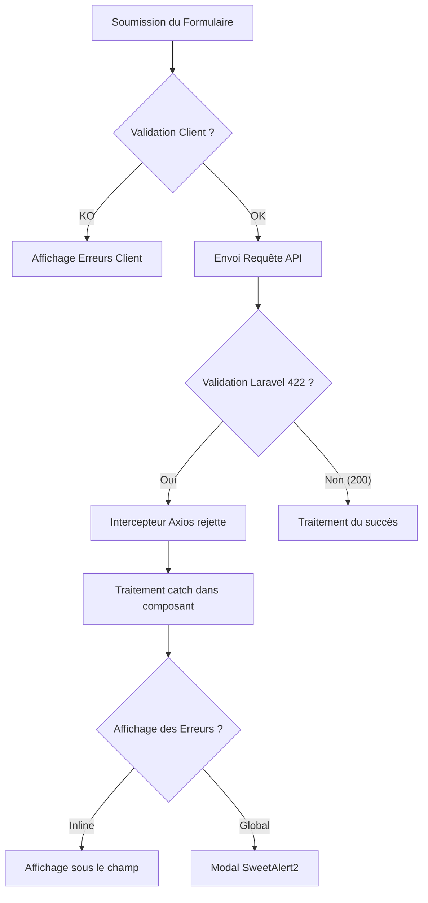
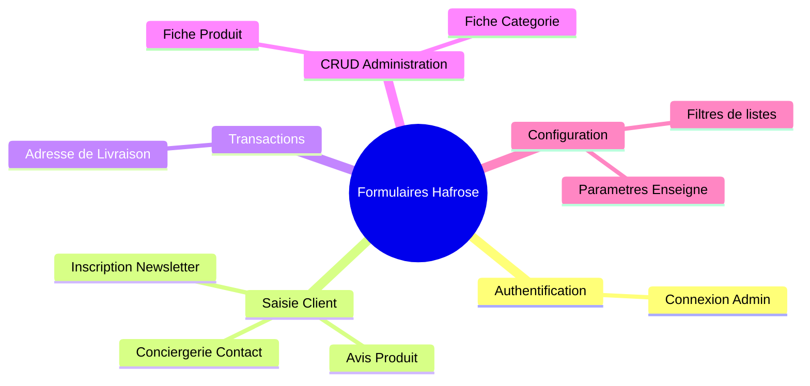

# HAFROSE — LUXURY FORM SYSTEM AUDIT
**Version** : 1.0  
**Phase** : 2.0.1  
**Statut** : Document d'audit officiel  
**Auteurs** : Principal UI/UX Architect & Lead Frontend Engineer  
**Contexte** : Analyse exhaustive de la dette technique, ergonomique, et d'accessibilité du système de saisie actuel en vue de concevoir le *Luxury Form System (Phase 2.0.2)*.

---

## Introduction & Vision

Dans le cadre de l'évolution de la plateforme numérique de la **Maison Hafrose**, l'expérience utilisateur doit refléter les valeurs fondamentales de la marque : **"Lenteur Luxueuse"** et **"Pureté Radicale"**. Les formulaires ne doivent pas être traités comme de simples éléments techniques de collecte de données, mais comme des interfaces conversationnelles et relationnelles d'exception. 

L'audit ci-présent dresse un état des lieux sans concession de l'ensemble des formulaires et des champs du projet (Front Office et Back Office). Il met en lumière une fragmentation technique importante, une duplication excessive de la logique de validation et du style visuel, ainsi que des lacunes critiques en termes d'accessibilité (WCAG 2.2 AA) et de performance.

---

## 1. Inventaire Complet des Formulaires

L'analyse du code source a permis d'identifier **9 formulaires actifs** répartis entre l'espace client (Front Office) et l'espace de gestion (Back Office).

| Fichier / Composant | Page / Emplacement | Rôle Fonctionnel | Type (FO/BO) | Taille | Complexité | Nbr Champs | Nbr Boutons | Validation Actuelle | API Appelee | Hook(s) Utilisé(s) | État de Chargement | Gestion des Erreurs |
| :--- | :--- | :--- | :--- | :--- | :--- | :--- | :--- | :--- | :--- | :--- | :--- | :--- |
| [Login.jsx](file:///c:/Users/DELL/Desktop/Hafrose/frontend/src/pages/Admin/Login.jsx) | `/admin/login` | Authentification admin | BO | Petit | Faible | 2 | 1 | Attributs HTML5 `required` | `/admin/login` (POST) | `useState`, `useEffect`, `useAuth` | Spinner bouton + Loader page | Alerte de carte générale (`Card variant="alert"`) |
| [Categories.jsx](file:///c:/Users/DELL/Desktop/Hafrose/frontend/src/pages/Admin/Categories.jsx) | Modal dans `/admin/categories` | Création / Édition de Catégorie | BO | Moyen | Moyenne | 4 | 4 | HTML5 `required`, retour d'API (Unique slug) | `/admin/categories` (POST/DELETE) | `useState`, `useQuery`, `useMutation`, `useQueryClient` | Spinner bouton (`loading` prop) | Fenêtres modales globales (SweetAlert2) |
| [Products.jsx](file:///c:/Users/DELL/Desktop/Hafrose/frontend/src/pages/Admin/Products.jsx) | Modal dans `/admin/products` | Création / Édition de Produit | BO | Grand | Élevée | 11 | 6+ | HTML5 `required`, retour d'API (Unique slug) | `/admin/products` (POST/DELETE) | `useState`, `useQuery`, `useMutation`, `useQueryClient` | Spinner bouton (`loading` prop) | Fenêtres modales globales (SweetAlert2) |
| [Settings.jsx](file:///c:/Users/DELL/Desktop/Hafrose/frontend/src/pages/Admin/Settings.jsx) | `/admin/settings` | Configuration générale du site | BO | Grand | Élevée | 12 | 3 | HTML5 `required`, retour d'API | `/admin/settings` (POST) | `useState`, `useQuery`, `useMutation`, `useQueryClient`, `useEffect` | Spinner bouton + Loader de page | Fenêtres modales globales (SweetAlert2) |
| [Orders.jsx](file:///c:/Users/DELL/Desktop/Hafrose/frontend/src/pages/Admin/Orders.jsx) | Modal dans `/admin/orders` | Mise à jour de statut | BO | Petit | Faible | 1 | 3 | Contrainte HTML5 de sélection | `/admin/orders/{id}/status` (PATCH) | `useMutation`, `useQueryClient`, `useState` | Spinner d'action global | Fenêtres modales globales (SweetAlert2) |
| [index.jsx (Contact)](file:///c:/Users/DELL/Desktop/Hafrose/frontend/src/pages/Contact/index.jsx) | `/contact` | Formulaire conciergerie client | FO | Moyen | Moyenne | 6 | 1 | Client (JS custom validate), Serveur (`StoreContactRequest`) | `/contact` (POST) | `useState`, `useDocumentTitle` | Texte bouton (`Envoi en cours...`) | Messages d'erreur sous les inputs (`errors` local) |
| [index.jsx (Cart)](file:///c:/Users/DELL/Desktop/Hafrose/frontend/src/pages/Cart/index.jsx) | `/cart` (Checkout) | Adresse et coordonnées de livraison | FO | Moyen | Moyenne | 4 | 1 | Client (JS custom validate), Serveur (`StoreOrderRequest`) | `/orders` (POST) | `useState`, `useCart`, `useNavigate`, `useDocumentTitle` | Texte bouton (`Validation en cours...`) | Messages d'erreur sous les inputs (`errors` local) |
| [index.jsx (Product)](file:///c:/Users/DELL/Desktop/Hafrose/frontend/src/pages/Product/index.jsx) | `/product/:slug` | Soumission d'avis client | FO | Petit | Faible | 3 | 1 | Client (JS custom validate), Serveur (`StoreReviewRequest`) | `/reviews` (POST) | `useState`, `useEffect`, `useCallback`, `useMemo` | Texte bouton (`Transmission...`) | Fenêtres modales globales (SweetAlert2) |
| [Footer.jsx](file:///c:/Users/DELL/Desktop/Hafrose/frontend/src/components/common/Footer.jsx) / [Newsletter.jsx](file:///c:/Users/DELL/Desktop/Hafrose/frontend/src/components/sections/Newsletter.jsx) | Pied de page & Section Home | Inscription Newsletter | FO | Petit | Faible | 1 | 1 | HTML5 `required` | En attente de connexion API | `useState` | Aucun | Aucun visuel |

---

## 2. Inventaire Complet des Champs (Form Fields)

Le recensement méthodique des types de champs à travers l'application révèle l'utilisation de **11 types de saisie distincts**.

### A. Input Texte (Text Input)
* **Occurrences** : 16
* **Fichiers concernés** : 
  * `Contact/index.jsx` (Nom complet)
  * `Cart/index.jsx` (Nom complet, Ville, Adresse complète)
  * `Admin/Categories.jsx` (Nom de la catégorie)
  * `Admin/Products.jsx` (Nom du produit, Couleur, Matière, Marque, Description Courte)
  * `Admin/Settings.jsx` (Nom enseigne, Téléphone, Facebook, Instagram, WhatsApp, Meta Title)
* **Variantes & Style** : 
  * FO : Utilise le composant `<Input>` standard (`bg-off-white`, `border-beige`, `rounded-none`, pas d'ombre, police `Plus Jakarta Sans`).
  * BO : Balises natives `<input type="text">` avec style Tailwind injecté directement (`bg-white`, `border-luxury-gold/15`, `rounded` - ce qui contredit la directive des angles droits nets `rounded-none` du Storefront).
* **Validation actuelle** : HTML5 `required` (BO), regex de taille max 255 caractères (FO et BO).

### B. Input Email (Email Input)
* **Occurrences** : 5
* **Fichiers concernés** : 
  * `Contact/index.jsx` (Adresse e-mail)
  * `Admin/Login.jsx` (Adresse email professionnelle)
  * `Admin/Settings.jsx` (Email de contact)
  * `Footer.jsx` & `Newsletter.jsx` (S'abonner)
* **Variantes & Style** : 
  * `Input.jsx` stylisé en FO.
  * Saisies natives en BO (Admin) et Newsletter (avec variantes de thèmes clair/sombre).
* **Validation actuelle** : Attribut HTML5 `type="email"`, regex personnalisée côté client en FO (`/^[^\s@]+@[^\s@]+\.[^\s@]+$/`), Laravel Request validator.

### C. Input Téléphone (Phone Input)
* **Occurrences** : 3
* **Fichiers concernés** : 
  * `Contact/index.jsx` (Téléphone - facultatif)
  * `Cart/index.jsx` (Téléphone - requis)
  * `Admin/Settings.jsx` (Téléphone de contact)
* **Validation actuelle** : Aucune validation de format international côté client (champ libre traité comme chaîne de caractères), taille max 50 caractères côté serveur.

### D. Input Nombre (Number Input)
* **Occurrences** : 4
* **Fichiers concernés** : 
  * `Admin/Products.jsx` (Prix - `step="0.01"`, Stock - `step="1"`)
  * `Shop/index.jsx` (Budget Min, Budget Max)
* **Validation actuelle** : HTML5 `min="0"`, conversion implicite de type.

### E. Password (Password Input)
* **Occurrences** : 1
* **Fichiers concernés** : `Admin/Login.jsx` (Mot de passe)
* **Validation actuelle** : HTML5 `required`. Pas d'option pour masquer/afficher le mot de passe.

### F. Textarea (Multi-line Input)
* **Occurrences** : 7
* **Fichiers concernés** : 
  * `Contact/index.jsx` (Votre message)
  * `Product/index.jsx` (Commentaire de l'avis client)
  * `Admin/Categories.jsx` (Description)
  * `Admin/Products.jsx` (Description Complète)
  * `Admin/Settings.jsx` (Adresse postale, Horaires d'ouverture, Meta Description)
* **Validation actuelle** : Longueur minimale en FO (10 caractères minimum pour les messages et avis), longueur maximale 5000 (Laravel rules).

### G. Select (Dropdown Selector)
* **Occurrences** : 5
* **Fichiers concernés** : 
  * `Contact/index.jsx` (Sujet)
  * `Admin/Products.jsx` (Catégorie)
  * `Admin/Orders.jsx` (Changement de statut)
  * `Shop/index.jsx` (Tri des produits, Filtre matière)
* **Validation actuelle** : HTML5 `required` sur les formulaires d'édition.

### H. Checkbox & Radio (Selection Inputs)
* **Occurrences** : 1 checkbox
* **Fichiers concernés** : `Admin/Products.jsx` (Produit Vedette - `is_featured`)
* **Validation actuelle** : Traité comme valeur booléenne simple (0 ou 1).

### I. Upload Image & Upload Galerie (File Inputs)
* **Occurrences** : 4 (1 catégorie, 1 paramètres enseigne, 2 produit)
* **Fichiers concernés** : 
  * `Admin/Categories.jsx` (Image principale)
  * `Admin/Products.jsx` (Image principale, Galerie d'images multiple)
  * `Admin/Settings.jsx` (Logo officiel, Favicon navigateur)
* **Validation actuelle** : Attribut HTML5 `accept="image/*"`, validation Laravel de type d'image (`jpeg,png,jpg,webp,svg,ico`) et taille maximale (max 2 Mo à 5 Mo).

### J. Input Date (Date Input)
* **Occurrences** : 1
* **Fichiers concernés** : `Table.jsx` (Composant de filtrage par date `Table.DateFilter`)
* **Validation actuelle** : Aucune.

---

## 3. Analyse des Duplications

L'analyse comparative des fichiers met en évidence une duplication massive du code HTML/CSS de mise en page et des déclarations de style. En l'absence d'une architecture unifiée pour les conteneurs de formulaires, les libellés et les styles d'état, chaque page ré-implémente sa propre logique.

### Visualisation des Duplications (Échantillon de code)

```html
<!-- Dupliqué 11 fois dans Admin/Products.jsx -->
<div>
  <label className="block text-xs font-semibold text-luxury-gray uppercase tracking-wider mb-2">Label</label>
  <input type="text" className="w-full px-4 py-2.5 bg-white border border-luxury-gold/15 rounded outline-none focus:border-luxury-gold text-sm" />
</div>

<!-- Dupliqué 12 fois dans Admin/Settings.jsx (avec une légère variation de couleur de fond) -->
<div>
  <label className="block text-xs font-semibold text-luxury-gray uppercase tracking-wider mb-2">Label</label>
  <input type="text" className="w-full px-4 py-2.5 bg-luxury-cream/30 border border-luxury-gold/15 rounded outline-none focus:border-luxury-gold text-sm" />
</div>
```

### Métriques des Éléments Dupliqués

| Élément Dupliqué | Nombre de Fichiers | Occurrences Totales | Lignes de Code Répétées (Est.) | Impact sur la Maintenance |
| :--- | :--- | :--- | :--- | :--- |
| **Classes de conteneur de champ** (`flex flex-col space-y-1.5`) | 4 (FO) | 12 | 40 | Faible (mais incohérence d'espacement) |
| **Classes de libellé d'administration** (`block text-xs font-semibold...`) | 4 (BO) | 26 | 52 | Élevé lors d'un changement de typographie globale |
| **Classes d'input texte d'administration** (`w-full px-4 py-2.5 bg-white...`) | 3 (BO) | 18 | 72 | Très élevé (incompatibilité avec le token `rounded-none`) |
| **Classes d'input texte en lecture seule / désactivé** | 3 | 8 | 24 | Incohérence dans l'expérience utilisateur d'administration |
| **Gestion visuelle des erreurs sous les champs** | 3 (FO) | 12 | 60 | Dispersion des animations et des styles de messages |
| **Honeypot anti-spam** | 2 | 2 | 10 | Logique de sécurité dupliquée |
| **Générateur automatique de slug** | 2 | 2 | 30 | Duplication de la fonction de formatage de chaîne de caractères |

**Estimation totale du code redondant** : **Plus de 430 lignes de code JSX** qui auraient pu être évitées par l'utilisation de composants de formulaire factorisés.

---

## 4. Audit UX / UI

L'évaluation ergonomique et graphique révèle plusieurs défauts majeurs par rapport aux standards du commerce électronique de luxe.

### Tableau d'Évaluation Ergonomique

| Problème UX/UI Identifié | Gravité | Impact Utilisateur | Recommandation Corrective (Luxury Standard) |
| :--- | :--- | :--- | :--- |
| **Incohérence du Border Radius** : L'administration utilise `rounded` (6px) ou `rounded-none` de manière arbitraire, tandis que la charte client est en `rounded-none` strict. | **Moyenne** | Rupture visuelle forte entre l'expérience client et l'outil interne. | Appliquer le token `--radius-luxury: 0px` de façon universelle, y compris pour l'administration. |
| **Absence d'états visuels clairs de Focus** : Les champs d'administration ne possèdent pas d'outline contrastée au focus (simple changement de couleur de bordure vers `--color-luxury-gold`). | **Moyenne** | Difficulté de repérage visuel lors de la navigation clavier. | Implémenter une outline Rose Gold (`#B5828C`) fine de 1px avec un `offset` de 2px au focus. |
| **Absence d'auto-complétion (Autocomplete)** : Les champs de coordonnées de livraison ne disposent pas d'attributs d'auto-remplissage standardisés. | **Faible** | Saisie fastidieuse des adresses et numéros de téléphone. | Ajouter les attributs `autoComplete` (`name`, `tel`, `address-line1`, `address-level2`). |
| **Mise en page des erreurs non standardisée** : Certaines erreurs s'affichent sous forme d'alertes SweetAlert2 globales et intrusives, d'autres sous forme de texte rouge sous les champs. | **Élevée** | Interruption brutale de l'expérience de saisie, mauvaise contextualisation de l'erreur. | N'utiliser les alertes SweetAlert2 que pour les statuts réseau (500, 429) et afficher toutes les erreurs de validation de manière inline et fluide sous le champ concerné. |
| **Absence de compteur de caractères en temps réel** : Les formulaires d'avis et de contact exigent un minimum de caractères mais ne fournissent aucun retour visuel avant la soumission. | **Moyenne** | Soumission frustrante de formulaires rejetés par la validation. | Ajouter un indicateur de longueur de texte sous la zone de saisie (`CharacterCounter`) qui s'actualise en temps réel. |
| **Absence d'indicateur visuel de champ obligatoire (\*)** : La mention d'obligation est gérée de manière invisible via l'attribut HTML `required` sans signalétique pour l'utilisateur. | **Faible** | Confusion sur les champs nécessaires. | Ajouter une signalétique esthétique (ex: point discret ou astérisque en Rose Gold). |

---

## 5. Audit Accessibilité (a11y)

L'accessibilité numérique (conformité WCAG 2.2 AA) a été évaluée sur l'ensemble des formulaires. Le système de saisie actuel présente plusieurs manquements sérieux qui empêchent une navigation correcte pour les utilisateurs utilisant des lecteurs d'écran ou naviguant exclusivement au clavier.

| Critère d'Accessibilité (a11y) | Statut | Constat Technique | Action Corrective Requise |
| :--- | :--- | :--- | :--- |
| **Liaison Label / Input (`htmlFor` / `id`)** | **Partiel** | Correctement géré dans le composant `<Input>` de base en générant un identifiant aléatoire s'il n'est pas fourni. Cependant, tous les champs d'administration (Select, Textarea et Inputs codés en dur) omettent de lier le label à l'input ou utilisent des structures sans `id`. | S'assurer que chaque étiquette (`<label>`) possède un attribut `htmlFor` correspondant à l'identifiant unique (`id`) du champ de saisie associé. |
| **Attributs sémantiques d'erreurs (`aria-invalid`)** | **Non conforme** | Aucun champ de saisie ne reçoit l'attribut `aria-invalid="true"` en cas d'erreur de validation active. | Injecter dynamiquement `aria-invalid={!!error}` sur le composant de saisie. |
| **Description des erreurs (`aria-describedby`)** | **Non conforme** | Les messages d'erreur affichés sous le champ ne sont pas liés sémantiquement à l'input. Les synthèses vocales ne lisent pas l'erreur lors du focus du champ. | Lier l'input au message d'erreur via `aria-describedby={`${inputId}-error`}`. |
| **Indicateur d'obligation (`aria-required`)** | **Non conforme** | L'obligation est signalée par l'attribut HTML5 `required` mais n'est pas explicitée s'implémentant dans l'arbre d'accessibilité pour les technologies d'assistance. | Ajouter l'attribut sémantique `aria-required="true"` sur tous les champs requis. |
| **Navigation Clavier & Ordre de tabulation** | **Partiel** | L'ordre naturel du DOM est préservé, mais la navigation dans les modaux d'administration n'emprisonne pas le focus (Focus Trap). L'utilisateur peut tabuler en dehors de la modal ouverte. | Implémenter un verrouillage du focus (Focus Trap) au sein des conteneurs de formulaires dans les modaux. |
| **Indicateur de focus visible (`focus-visible`)** | **Partiel** | Souvent masqué par des réinitialisations de style (`outline-none` sans alternative visuelle contrastée). | Remplacer les styles de focus par défaut par des contours visibles et stylisés via le sélecteur `:focus-visible`. |
| **Zones de glisser-déposer de fichiers (Drag & Drop)** | **Non conforme** | La zone de médiathèque (`Admin/Media.jsx`) repose sur un événement de glissement sans alternative clavier claire pour le téléversement de fichiers multiples. | Rendre le bouton déclencheur de sélection accessible par tabulation et déclenchable par la touche Espace/Entrée. |

---

## 6. Audit Validation (Form Validation Layout)

La validation est actuellement éclatée entre le client (JavaScript synchrone) et le serveur (Laravel Form Requests). La communication des erreurs serveur vers le client n'est pas harmonisée.



### Mécanisme de Validation par Formulaire

1. **Contact Client** :
   * Validation client synchrone via une fonction locale `validate()`.
   * Envoi à l'API uniquement si les tests passent.
   * Si l'API retourne un statut 422 (géré par `StoreContactRequest`), les erreurs serveur écrasent le tableau d'erreurs locales et sont injectées sous les champs.
2. **Commande / Panier** :
   * Identique au formulaire de contact. Validation client stricte pour éviter les appels API inutiles.
3. **Catégories & Produits d'Administration** :
   * **Aucune validation client** : les formulaires s'appuient uniquement sur l'attribut HTML5 `required`.
   * En cas de données invalides ou de doublon (slug déjà existant), le serveur API Laravel rejette la demande avec un code 422.
   * Le composant capture l'erreur générale et l'affiche dans un popup SweetAlert2. Les champs en faute ne sont pas mis en surbrillance, ce qui nuit gravement à l'expérience de correction.
4. **Paramètres Administrateur** :
   * Repose entièrement sur la validation serveur (`UpdateSettingsRequest`).
   * Les erreurs de type d'image ou de champs requis sont affichées dans une boîte de dialogue générale SweetAlert2.

---

## 7. Audit Technique (State & Data Management)

Le projet utilise des technologies modernes mais les intègre de manière rudimentaire concernant les formulaires.

### État de l'Art Technique Actuel

| Technologie / Méthode | Utilisation Actuelle | Problématiques Identifiées | Recommandation d'Évolution |
| :--- | :--- | :--- | :--- |
| **Gestion d'état locale** | `useState` multiple (un par champ) ou objet d'état unique. | Écriture de dizaines de fonctions de modification (`setField`), re-rendus de l'intégralité du composant parent à chaque frappe de touche. | Transition vers des formulaires non-contrôlés (Ref) ou utilisation d'une bibliothèque dédiée pour limiter les rendus. |
| **Bibliothèque de formulaires** | Aucune (pas de React Hook Form ni Formik). | Absence de gestion d'état de validation ("dirty", "touched"), code verbeux pour la gestion des soumissions et de la réinitialisation. | Introduire une approche standardisée de formulaires via les fonctionnalités natives de React 19 ou une intégration légère de React Hook Form. |
| **Requêtes & Mutations** | TanStack Query (`useQuery` et `useMutation`). | Correctement implémenté en BO pour les actions asynchrones, mais mal connecté à l'état des champs (pas de réinitialisation automatique au succès). | Lier la réinitialisation du formulaire (`reset()`) à l'événement `onSuccess` des mutations TanStack Query. |
| **Téléversement de fichiers** | Direct via `FormData` encodé en `multipart/form-data`. | Pas de barre de progression de téléversement, pas de gestion de file d'attente pour les galeries d'images volumineuses. | Implémenter un service de téléversement asynchrone avec retour d'état de progression pour améliorer le confort visuel lors des téléversements lourds. |
| **Inputs Contrôlés vs Non-contrôlés** | 100% Contrôlés (liaison directe sur `value` et `onChange`). | Surcharge de rendus mémoires du DOM sur les formulaires complexes (ex : `Products.jsx` avec 11 champs et de nombreuses images). | Privilégier les inputs non-contrôlés pour les champs n'exigeant pas de validation immédiate à la saisie. |

---

## 8. Analyse des Performances (Rendering & Re-renders)

L'absence d'optimisation de rendu sur les formulaires complexes provoque des ralentissements perceptibles sur les configurations modestes ou mobiles.

### Diagnostic de Performance

1. **Re-renders en cascade lors de la saisie** :
   Dans [Products.jsx](file:///c:/Users/DELL/Desktop/Hafrose/frontend/src/pages/Admin/Products.jsx) et [Settings.jsx](file:///c:/Users/DELL/Desktop/Hafrose/frontend/src/pages/Admin/Settings.jsx), la saisie d'un seul caractère dans un champ texte (ex: nom du produit) déclenche le rendu de l'intégralité de la page d'administration, incluant les tableaux sous-jacents, les barres latérales de navigation et les modals. Cela s'explique par le fait que l'état du formulaire est stocké dans le composant page principal au lieu d'être encapsulé.
2. **Absence de Debounce sur la génération du Slug** :
   La génération du slug de produit et de catégorie s'exécute à chaque lettre saisie dans le champ "Nom" :
   ```javascript
   // Exécuté à CHAQUE modification de caractère
   setSlug(value.toLowerCase().normalize('NFD').replace(...));
   ```
   Ce traitement de chaîne complexe ralentit le thread principal.
3. **Absence de mémoïsation (useCallback / useMemo)** :
   Les gestionnaires d'événements (`handleChange`, `handleSubmit`) sont recréés à chaque cycle de rendu de la page. Les composants de formulaire ne tirent pas parti de `React.memo` pour bloquer les rendus inutiles lorsque leurs propriétés ne changent pas.
4. **Traitement lourd des prévisualisations d'images** :
   L'utilisation de `FileReader.readAsDataURL` pour générer des chaînes Base64 volumineuses charge la mémoire du navigateur, en particulier lors du téléversement d'images de plusieurs mégaoctets dans la galerie.

---

## 9. Classification des Formulaires

Pour structurer la future factorisation des composants dans la Phase 2.0.2, les formulaires du projet sont classés en **5 catégories sémantiques**.



| Catégorie de Formulaire | Formulaires Associés | Caractéristiques Techniques | Besoins Spécifiques d'Interface |
| :--- | :--- | :--- | :--- |
| **Authentification (Auth)** | Connexion Admin | Sécurisé, court, pas d'état persistant, focus automatique. | Masquage de mot de passe, autofocus initial, gestion claire des erreurs de session. |
| **Saisie Client (Inquiry)** | Contact, Avis Produit | Public, orienté conversion, validation en temps réel. | Honeypot invisible, transitions fluides, retours de succès valorisants, compteurs de caractères. |
| **Transactions (Checkout)** | Adresse de Livraison | Rapide, auto-complétion, hautement structuré. | Masques de saisie (téléphone, code postal), boutons d'action larges et rassurants. |
| **CRUD Administration** | Fiches Produit et Catégorie | Complexe, champs multiples, uploads de fichiers. | Gestion des fichiers (drag & drop), intégration de la médiathèque, sélecteurs personnalisés, onglets. |
| **Configuration (Settings)** | Paramètres Enseigne | Très grand nombre de champs, sauvegardes partielles. | Navigation interne par onglets, sauvegarde globale flottante ou persistante. |

---

## 10. Opportunités de Factorisation

Pour éliminer les duplications de code et harmoniser le style visuel avec le Design System de la Maison Hafrose, l'architecture suivante de composants autonomes et réutilisables est recommandée pour la Phase 2.0.2.

### Structure Proposée de la Bibliothèque de Formulaire

```
components/ui/form/
├── Form.jsx                  # Wrapper de formulaire gérant la soumission globale et l'accessibilité
├── FormGroup.jsx             # Regroupement visuel de champs (ex: colonnes réactives)
├── FormSection.jsx           # Section thématique avec titre sémantique (Cormorant Garamond)
├── Label.jsx                 # Libellé standardisé (Plus Jakarta Sans, uppercase, tracking)
├── HelperText.jsx            # Texte d'aide ou de description sous le champ
├── ErrorMessage.jsx          # Message d'erreur stylisé avec animation de fondu
├── CharacterCounter.jsx      # Compteur de caractères dynamique pour textareas
├── Input.jsx                 # Champ de texte unifié (gère text, email, tel, number, password)
├── Textarea.jsx              # Zone de saisie multiligne redimensionnable
├── Select.jsx                # Menu déroulant stylisé (conforme aux dropdowns de luxe)
├── Checkbox.jsx              # Case à cocher personnalisée Rose Gold / Anthracite
├── FileUpload.jsx            # Zone de dépôt de fichiers drag & drop accessible
└── ImagePicker.jsx           # Sélecteur combiné (Upload fichier local + Intégration Médiathèque)
```

---

## 11. Incohérences avec le Design System

Plusieurs éléments des formulaires actuels enfreignent directement les spécifications visuelles du Design System de la Maison Hafrose.

### Tableau des Priorités de Correction Visuelle

| Élément non conforme | Fichier / Emplacement | Constat Actuel | Spécification attendue | Niveau de Priorité |
| :--- | :--- | :--- | :--- | :--- |
| **Bordures arrondies (Radius)** | `Admin/Categories.jsx`, `Admin/Products.jsx`, `Admin/Login.jsx` | Utilisation des classes `rounded` de Tailwind (arrondu de 6px) sur les inputs et sélecteurs de l'administration. | Tous les champs de saisie doivent être configurés avec `rounded-none` pour correspondre à l'identité géométrique de la Maison. | **Haute** |
| **Couleurs sémantiques d'erreurs** | `Contact/index.jsx`, `Product/index.jsx` | Utilisation de classes de couleur génériques de Tailwind (`border-rose-400`, `text-rose-500`, `text-rose-500`). | Utiliser exclusivement les variables sémantiques globales : `--color-error` (`#A33E53`) et `--color-error-bg` (`#FAF0F2`). | **Haute** |
| **Polices de caractères (Fonts)** | Tous les formulaires d'administration | Titres et étiquettes utilisant la police système par défaut au lieu des polices officielles de la charte. | Titres de formulaires en *Cormorant Garamond*, textes de saisie et labels en *Plus Jakarta Sans*. | **Moyenne** |
| **États visuels de survol (Hover)** | `Shop/index.jsx`, `Admin/Products.jsx` | Bordures de survol configurées sur des couleurs sombres arbitraires (`hover:border-warm-gray`). | Bordures au survol unifiées sur la teinte Rose Poudré ou Rose Gold douce. | **Moyenne** |
| **Boutons d'action (Buttons)** | `Admin/Login.jsx`, `Product/index.jsx` | Boutons stylisés à l'aide de classes Tailwind manuelles en contradiction avec le *Luxury Button System*. | Remplacer toutes les balises de soumission par le composant unifié `<Button>` avec les variantes et tailles appropriées. | **Haute** |
| **Modals de formulaires (Modals)** | `Admin/Categories.jsx`, `Admin/Products.jsx` | Modals construites avec des structures HTML personnalisées qui dupliquent le style de fond et les bordures. | Utiliser le composant `<Modal>` du *Luxury Modal & Dialog System* pour envelopper tous les formulaires d'édition. | **Haute** |

---

## 12. Recommandations pour la Phase 2.0.2

Pour la phase de conception et d'implémentation du **Luxury Form System (Phase 2.0.2)**, les directives techniques et d'architecture suivantes devront être appliquées.

### 12.1. Principes d'Architecture & Composition API
* **Encapsulation de l'État** : L'état local de chaque formulaire doit être encapsulé dans un composant dédié ou géré via des références non-contrôlées afin d'éviter les re-rendus de la page parente.
* **Compatibilité Native avec React Hook Form** : Tous les nouveaux composants de saisie (Inputs, Textarea, Select, etc.) doivent être enveloppés dans la fonction `forwardRef` de React pour permettre une liaison directe et transparente avec les bibliothèques de formulaires (notamment React Hook Form) et assurer une gestion optimale du focus.
* **Format Standard de Retour d'Erreurs** : Les composants doivent intégrer un parseur d'erreurs d'API standardisé pour convertir automatiquement les retours d'erreurs 422 de Laravel en messages inline sous chaque champ en reliant les clés d'erreurs (ex: `site_name` ou `settings.site_name`).

### 12.2. Design Tokens CSS Recommandés (Tailwind CSS v4)
Les tokens suivants devront être ajoutés à la directive `@theme` dans le fichier global `index.css` :

```css
@theme {
  /* Luxury Form System Design Tokens */
  --color-form-bg-input: var(--color-off-white);
  --color-form-bg-input-admin: var(--color-off-white);
  --color-form-bg-input-disabled: rgba(242, 237, 232, 0.40);
  
  --color-form-border-default: var(--color-border);
  --color-form-border-hover: var(--color-rose-poudre);
  --color-form-border-focus: var(--color-rose-gold);
  --color-form-border-error: var(--color-error);
  --color-form-border-success: var(--color-success);
  
  --color-form-text-input: var(--color-text-primary);
  --color-form-text-placeholder: rgba(127, 127, 127, 0.50);
  --color-form-text-label: var(--color-text-primary);
  --color-form-text-helper: var(--color-text-secondary);
  --color-form-text-error: var(--color-error-text);
  
  --radius-form-input: var(--radius-luxury); /* 0px */
  --transition-form: border-color 0.4s var(--ease-luxury), background-color 0.4s var(--ease-luxury);
}
```

### 12.3. Intégration avec les Systèmes Existants
* **Luxury Button System** : Intégrer les boutons de soumission en utilisant les variantes `primary` et `secondary` avec gestion automatique de l'état `loading` (affichage d'un micro-spinner et désactivation des clics).
* **Luxury Card System** : Les formulaires d'administration doivent être enveloppés dans des cartes de variante `admin` avec la signalétique de bordure discrète associée.
* **Luxury Modal System** : Les formulaires de création et de modification (Produits, Catégories) devront s'intégrer proprement dans les composants `Modal.Body` et `Modal.Footer` existants, en héritant du style d'en-tête et de fermeture.
* **Table System** : Les composants de filtrage et de recherche (`Table.Search`, `Table.Filter`, `Table.DateFilter`) devront être refactorisés pour réutiliser en interne les styles visuels et de focus du nouveau *Luxury Form System*.

---

## Conclusion de l'Audit

Le système de formulaires actuel de Hafrose souffre d'une fragmentation importante et d'un manque d'uniformité visuelle et technique. La Phase 2.0.2 devra se concentrer sur la création d'une bibliothèque de composants de saisie hautement réutilisables, accessibles et conformes à l'esthétique minimaliste et prestigieuse de la marque. Cette transition permettra non seulement d'améliorer l'expérience de saisie des clients et des administrateurs, mais également de réduire la base de code d'environ 400 lignes de redondances visuelles.
