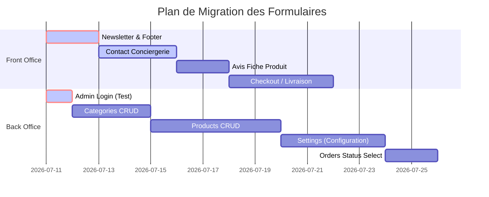

# HAFROSE — BLUEPRINT DU LUXURY FORM SYSTEM
**Version** : 1.0  
**Phase** : 2.0.2  
**Statut** : Spécification technique approuvée  
**Auteurs** : Principal UI/UX Architect & Lead Frontend Engineer  
**Contexte** : Architecture complète, spécifications et design tokens du système de formulaires de la Maison Hafrose.

---

## 1. Philosophie

Le **Luxury Form System** de la Maison Hafrose repose sur trois piliers fondamentaux : **"Pureté Radicale"**, **"Lenteur Luxueuse"** et **"Rigueur Technique"**. Il ne s'agit pas simplement d'un ensemble de champs de saisie, mais d'une infrastructure d'interaction unifiée qui sublime le rapport entre l'utilisateur (client ou gestionnaire) et les systèmes d'information.

### 1.1. Principes Directeurs
1. **Pureté Radicale (Esthétique minimaliste)** : 
   * Alignement géométrique strict (utilisation systématique de la grille 4px/8px).
   * Angles droits nets (`rounded-none` / `0px` de rayon) pour l'intégralité des saisies clients (Storefront) et de gestion (Back Office), assurant une harmonie totale avec le *Luxury Card System* et le *Luxury Button System*.
   * Suppression de toute pollution visuelle. Les séparateurs horizontaux d'une finesse de `1px` (`border-beige`) et le vide éditorial sont privilégiés par rapport aux ombres ou aux bordures lourdes.
2. **Lenteur Luxueuse (Mouvement & Micro-interactions)** :
   * Les transitions d'état (survol, focus, affichage des erreurs) durent uniformément **0,4 seconde** avec une courbe d'accélération fluide brevetée : `cubic-bezier(0.16, 1, 0.3, 1)`.
   * Les placeholders s'estompent doucement au focus au lieu de disparaître brusquement.
   * L'affichage des messages d'erreur et de succès s'effectue via un micro-mouvement d'apparition vertical amorti (fade-in-down).
3. **Rigueur Technique (Robustesse & Performance)** :
   * **React Hook Form (RHF)** : Prise en charge native via l'encapsulation `forwardRef` sur tous les champs pour permettre une liaison sans re-rendus de page.
   * **TanStack Query** : Synchronisation des états de soumission et de désactivation avec les cycles de vie des mutations.
   * **Laravel Validation Integration** : Conversion transparente des payloads d'erreurs d'API 422 en alertes ciblées (inline) et résumés d'erreurs accessibles.
   * **Accessibilité WCAG 2.2 AA** : Structure sémantique irréprochable avec liaisons d'identifiants uniques, gestion dynamique des attributs d'état (`aria-invalid`, `aria-describedby`, `aria-required`), et verrouillage du focus (Focus Trap) dans les overlays.

---

## 2. Architecture des Composants

Le système s'articule autour d'une composition d'API modulaire. Le composant racine `<Form>` expose ses enfants sous forme de sous-composants sémantiques.

```
<Form>
  ├── <Form.Header>
  │     ├── <Form.Title>
  │     └── <Form.Description>
  ├── <Form.Section>
  │     ├── <Form.Row>
  │     │     └── <Form.Group>
  │     │           └── <Form.Field>
  │     │                 ├── <Form.Label>
  │     │                 ├── <Input> / <Textarea> / <Select> ...
  │     │                 ├── <Form.Helper>
  │     │                 ├── <Form.Error>
  │     │                 ├── <Form.Success>
  │     │                 └── <Form.Counter>
  │     └── <Form.Divider>
  └── <Form.Footer>
        └── <Form.Actions>
```

### 2.1. Les Composants Structurels

#### A. `<Form>`
* **Rôle** : Wrapper principal qui englobe le formulaire et gère l'état d'accessibilité globale et de soumission.
* **Props** : 
  * `onSubmit` (Function, requis) : Handler de soumission.
  * `noValidate` (Boolean, par défaut `true`) : Désactive la validation native du navigateur au profit de RHF ou de la validation custom.
  * `className` (String) : Classes de style personnalisées.
  * `aria-label` / `aria-labelledby` (String) : Libellé accessible.
* **Accessibilité** : Rend une balise sémantique `<form>` et gère la capture de la touche Entrée.

#### B. `<Form.Header>` & `<Form.Title>` & `<Form.Description>`
* **Rôle** : Entête optionnelle du formulaire, utile pour présenter l'action (ex: "Adresse de Livraison").
* **Props** : 
  * `as` (String, par défaut `"h2"`) : Balise sémantique de titre.
  * `className` (String) : Styles personnalisés.
* **Style** : Titre configuré avec la typographie Cormorant Garamond (Sérif raffinée) et description en Plus Jakarta Sans (Sans-sérif légère).

#### C. `<Form.Section>`
* **Rôle** : Regroupement logique de champs de formulaires (ex: "Coordonnées de livraison" et "Options de facturation").
* **Props** : 
  * `title` (String, optionnel) : Titre de la section.
  * `description` (String, optionnel) : Texte descriptif de la section.
* **Accessibilité** : Génère une balise sémantique `<fieldset>` avec un élément `<legend>` associé pour les lecteurs d'écran.

#### D. `<Form.Row>`
* **Rôle** : Grille horizontale réactive alignant un ou plusieurs champs.
* **Props** : 
  * `cols` (Number / Object, par défaut `1`) : Nombre de colonnes (ex: `1` sur mobile, `{ md: 2 }` sur tablette/desktop).
* **Style** : Implémente une disposition Flex ou Grid avec un écartement standardisé (`gap-sp-6`).

#### E. `<Form.Group>`
* **Rôle** : Conteneur pour un couple Label + Input + Messages d'erreur ou d'aide.
* **Props** : 
  * `className` (String).
* **Style** : Stack vertical avec un espacement strict de 6px (`space-y-sp-1.5`).

#### F. `<Form.Field>`
* **Rôle** : Composant de contexte invisible qui distribue les identifiants d'accessibilité (comme l'ID unique et l'ID de message d'erreur) à ses sous-composants enfants.
* **Props** : 
  * `name` (String, requis) : Nom unique du champ.
  * `error` (String) : Message d'erreur associé.
  * `success` (Boolean / String) : Message de succès associé.
* **Responsabilité** : Génère par défaut un ID unique stable (ex: `field-name-123`) et distribue via le contexte React `id`, `aria-describedby` et `aria-invalid` à l'Input et aux composants de feedback.

#### G. `<Form.Label>`
* **Rôle** : Étiquette textuelle du champ.
* **Props** : 
  * `required` (Boolean, optionnel) : Affiche l'indicateur visuel d'obligation.
* **Accessibilité** : Utilise le `htmlFor` généré automatiquement par `<Form.Field>`.
* **Style** : Police Plus Jakarta Sans, uppercase, taille 10px, tracking large (`tracking-[0.25em]`).

#### H. `<Form.Helper>`
* **Rôle** : Texte d'aide ou d'information sous le champ.
* **Style** : Police Plus Jakarta Sans, taille 11px (`text-body-small`), gris chaud (`text-warm-gray`).
* **Accessibilité** : Reçoit l'identifiant pour la liaison `aria-describedby`.

#### I. `<Form.Error>` & `<Form.Success>`
* **Rôle** : Messages d'erreur et de succès contextualisés.
* **Props** : 
  * `animate` (Boolean, par défaut `true`) : Active les micro-animations d'apparition.
* **Style** : 
  * Error : Fond Grenat Doux (`bg-error-bg`), texte rouge Grenat (`text-error-text`), bordure fine 1px, taille 10px.
  * Success : Fond Vert Céladon (`bg-success-bg`), texte Vert sombre (`text-success-text`), taille 10px.
* **Accessibilité** : Contient l'attribut `aria-live="polite"` pour avertir immédiatement l'utilisateur d'un lecteur d'écran en cas de modification.

#### J. `<Form.Counter>`
* **Rôle** : Affichage dynamique des caractères pour les zones de texte.
* **Props** : 
  * `current` (Number) : Nombre actuel de caractères.
  * `max` (Number) : Limite autorisée.
* **Style** : Alignement à droite, taille 9px, police mono.

#### K. `<Form.Footer>` & `<Form.Actions>`
* **Rôle** : Bas de formulaire contenant les boutons d'action (Valider, Annuler).
* **Style** : Ligne horizontale flexible, alignée à droite, isolée par une marge supérieure (`mt-sp-8`).

#### L. `<Form.Divider>`
* **Rôle** : Ligne de séparation esthétique fine.
* **Style** : `h-[1px] bg-beige w-full my-sp-6`.

---

## 3. Composants de Saisie (Form Fields Specifications)

Chaque champ de saisie doit implémenter une API unifiée, respecter les états graphiques décrits, et exporter sa référence pour être lié à React Hook Form.

### 3.1. API Commune (Props de base)
```typescript
interface BaseInputProps extends React.InputHTMLAttributes<HTMLInputElement> {
  variant?: 'default' | 'admin' | 'client' | 'filled' | 'outlined' | 'ghost' | 'readonly';
  size?: 'xs' | 'sm' | 'md' | 'lg' | 'xl';
  error?: string;
  success?: string | boolean;
  ref?: React.Ref<any>;
}
```

---

### 3.2. Spécifications détaillées par Composant

| Composant | Rôle Visuel & Rendu HTML | Props Spécifiques | Variantes & Tailles | États Graphiques | Accessibilité |
| :--- | :--- | :--- | :--- | :--- | :--- |
| **Input** | Champ texte standard `<input type="...">` | `type` (text, email, tel, number) | Outlined, Filled, Ghost. Tailles: sm, md, lg. | Default, Hover, Focus, Disabled, ReadOnly. | `aria-invalid`, `aria-describedby`, `htmlFor`. |
| **Textarea** | Zone de texte multi-lignes `<textarea>` | `rows` (par défaut 4), `resize` (none, y) | Outlined, Filled. Tailles: md, lg. | Identiques à l'Input. Comprend le compteur de caractères. | `aria-multiline="true"`. |
| **Select** | Menu de sélection customisé ou natif | `options` (Array of objects), `placeholder` | Outlined. Tailles: sm, md, lg. | Default, Focus, Dropdown ouvert. | `role="combobox"`, `aria-expanded`. |
| **Checkbox** | Case à cocher `<input type="checkbox">` | `checked`, `onChange` | Rose Gold accent, square box. Taille unique: 16px. | Checked, Unchecked, Hover, Focus. | `role="checkbox"`, `aria-checked`. |
| **Radio** | Bouton radio `<input type="radio">` | `name`, `value`, `checked` | Concentrique Rose Gold. Taille: 16px. | Selected, Unselected, Focus. | `role="radio"`, `aria-checked`. |
| **Switch** | Toggle switch (glisseur booléen) | `checked`, `onChange` | Piste Blush, curseur Rose Gold. | On (active), Off (inactive), Disabled. | `role="switch"`, `aria-checked`. |
| **PasswordField** | Saisie de sécurité pour mot de passe | `showToggle` (afficher l'icône oeil) | Outlined. Taille: md. | Focus, Affichage clair. | `type="password"` ou `type="text"`. |
| **EmailField** | Saisie d'email avec validation regex | `validateOnBlur` | Outlined. Tailles: sm, md. | Identique à l'input. | `type="email"`, `autoComplete="email"`. |
| **PhoneField** | Saisie de numéro de téléphone | `countryCode` (préfixe pays) | Outlined. Taille: md. | Focus, Saisie du préfixe. | `type="tel"`, `autoComplete="tel"`. |
| **PriceField** | Saisie monétaire avec suffixe "€" | `currency` (par défaut "EUR") | Outlined, text-right. | Default, Focus, Disabled. | `aria-valuemin="0"`, suffixe décoratif ignoré des lecteurs. |
| **NumberField** | Saisie numérique avec incrémenteurs | `min`, `max`, `step` | Outlined avec boutons +/- latéraux. | Focus, Limite atteinte. | `role="spinbutton"`, `aria-valuenow`. |
| **SearchField** | Recherche instantanée avec icône loupe | `onClear`, `debounceTime` (ms) | Outlined, Rounded-none, loupe à droite. | Saisie active, vidage actif. | `type="search"`, `aria-label`. |
| **SlugField** | Champ de saisie mono-caractère url | `sourceField` (liaison au nom) | Outlined, font-mono, text-xs. | Modifié manuellement (dirty), auto-généré. | `readOnly` par défaut avec cadenas. |
| **UploadField** | Zone de dépôt de fichier (Drag & Drop) | `multiple`, `accept`, `maxSize` | Dotted border Beige, survol or. | Default, Drag Over, Uploading. | Focus clavier sur la zone active, touche Espace déclencheuse. |
| **ImagePicker** | Sélecteur image local + médiathèque | `onMediaSelect`, `currentImage` | Panel avec vignette carrée de prévisualisation. | Sélectionné, Vide. | Description textuelle alternative obligatoire. |
| **GalleryPicker** | Gestionnaire d'images multiples | `maxImages`, `onGalleryChange` | Grille de vignettes carrées avec croix de suppression. | Tri actif (drag-drop vignette), max atteint. | Raccourcis clavier pour déplacer/supprimer. |
| **LocationField**| Adresse avec auto-complétion | `apiKey`, `onAddressSelect` | Outlined avec liste de suggestions. | Liste ouverte, suggestion survolée. | `aria-autocomplete="list"`, `aria-controls`. |
| **ColorField** | Nuancier de sélection de couleurs | `palette` (Array de codes hexadécimaux) | Cercles colorés cliquables avec coche centrale. | Sélectionné, Survolé. | `aria-label="Couleur Noir"`. |
| **DateField** | Saisie de date stylisée | `minDate`, `maxDate` | Outlined avec calendrier personnalisé. | Focus, Calendrier affiché. | `type="date"`. |
| **Autocomplete** | Saisie de texte avec auto-complétion | `suggestions`, `onSelect` | Outlined avec panneau déroulant. | Suggestion active. | `role="listbox"`. |
| **HiddenField** | Champ masqué (anti-spam / jeton) | `value`, `name` | Invisible (`hidden`, `tabIndex="-1"`, `aria-hidden="true"`) | Inactif pour l'utilisateur. | Totalement invisible pour les lecteurs d'écran. |
| **FilePreview** | Vignette de prévisualisation | `file`, `onRemove` | Carré 80x80px avec bouton supprimer. | Image chargée, format invalide. | Description et bouton d'action accessible. |

---

## 4. Composition API (Conceptual Interface Showcase)

Les exemples ci-dessous décrivent comment un développeur composera les formulaires à l'aide de l'API déclarative.

### 4.1. Formulaire d'Authentification (Connexion Admin)
```jsx
<Form onSubmit={handleLogin}>
  <Form.Header>
    <Form.Title>Hafrose Admin</Form.Title>
    <Form.Description>Console de Gestion d'Entreprise</Form.Description>
  </Form.Header>

  <Form.Section>
    <Form.Field name="email" error={errors.email}>
      <Form.Label>Adresse email professionnelle</Form.Label>
      <EmailField 
        placeholder="admin@hafrose.com" 
        variant="admin"
        required 
      />
    </Form.Field>

    <Form.Field name="password" error={errors.password}>
      <Form.Label>Mot de passe</Form.Label>
      <PasswordField 
        placeholder="••••••••" 
        variant="admin"
        required 
      />
    </Form.Field>
  </Form.Section>

  <Form.Footer>
    <Button type="submit" variant="primary" fullWidth loading={isSubmitting}>
      Se connecter
    </Button>
  </Form.Footer>
</Form>
```

### 4.2. CRUD Produit (Espace Admin - Panel Modal)
```jsx
<Form onSubmit={handleProductSave}>
  <Form.Section title="Informations Principales">
    <Form.Row cols={{ default: 1, md: 3 }}>
      <Form.Field name="name" error={errors.name}>
        <Form.Label>Nom du produit</Form.Label>
        <Input placeholder="Vase d'Argile Dorée" variant="admin" required />
      </Form.Field>

      <Form.Field name="slug" error={errors.slug}>
        <Form.Label>Slug d'accès</Form.Label>
        <SlugField variant="admin" required />
      </Form.Field>

      <Form.Field name="category_id" error={errors.category_id}>
        <Form.Label>Catégorie</Form.Label>
        <Select options={categoriesList} placeholder="Choisir une collection" variant="admin" required />
      </Form.Field>
    </Form.Row>

    <Form.Row cols={{ default: 2, md: 5 }}>
      <Form.Field name="price" error={errors.price}>
        <Form.Label>Prix</Form.Label>
        <PriceField variant="admin" required />
      </Form.Field>

      <Form.Field name="stock" error={errors.stock}>
        <Form.Label>Stock disponible</Form.Label>
        <NumberField variant="admin" min={0} required />
      </Form.Field>

      <Form.Field name="color" error={errors.color}>
        <Form.Label>Couleur</Form.Label>
        <Input placeholder="Or / Noir" variant="admin" />
      </Form.Field>

      <Form.Field name="material" error={errors.material}>
        <Form.Label>Matière noble</Form.Label>
        <Input placeholder="Argile cuite" variant="admin" />
      </Form.Field>

      <Form.Field name="brand" error={errors.brand}>
        <Form.Label>Marque</Form.Label>
        <Input placeholder="Hafrose Paris" variant="admin" />
      </Form.Field>
    </Form.Row>
  </Form.Section>

  <Form.Divider />

  <Form.Section title="Médias & Visuels">
    <Form.Row cols={{ default: 1, md: 2 }}>
      <Form.Field name="image" error={errors.image}>
        <Form.Label>Image Principale (Fiche produit)</Form.Label>
        <ImagePicker variant="admin" />
      </Form.Field>

      <Form.Field name="galleries" error={errors.galleries}>
        <Form.Label>Galerie secondaire (Défilement)</Form.Label>
        <GalleryPicker variant="admin" maxImages={6} />
      </Form.Field>
    </Form.Row>
  </Form.Section>

  <Form.Footer>
    <Form.Actions>
      <Button type="button" onClick={closeModal} variant="secondary">Annuler</Button>
      <Button type="submit" variant="primary" loading={isSaving}>Enregistrer la création</Button>
    </Form.Actions>
  </Form.Footer>
</Form>
```

### 4.3. Formulaire de Commande (Front Office Checkout)
```jsx
<Form onSubmit={handleCheckoutSubmit}>
  <Form.Header>
    <Form.Title>Adresse de Livraison</Form.Title>
  </Form.Header>

  <Form.Section>
    <Form.Field name="customer" error={errors.customer}>
      <Form.Label>Nom complet</Form.Label>
      <Input placeholder="M. ou Mme Prénom Nom" variant="client" required />
    </Form.Field>

    <Form.Row cols={{ default: 1, md: 2 }}>
      <Form.Field name="phone" error={errors.phone}>
        <Form.Label>Numéro de téléphone</Form.Label>
        <PhoneField placeholder="+33 6 12 34 56 78" variant="client" required />
      </Form.Field>

      <Form.Field name="city" error={errors.city}>
        <Form.Label>Ville</Form.Label>
        <Input placeholder="Paris" variant="client" required />
      </Form.Field>
    </Form.Row>

    <Form.Field name="address" error={errors.address}>
      <Form.Label>Adresse complète de livraison</Form.Label>
      <LocationField placeholder="12, Avenue Montaigne" variant="client" required />
    </Form.Field>
  </Form.Section>

  <Form.Footer>
    <Button type="submit" variant="primary" fullWidth loading={isSubmitting}>
      Confirmer & Régler la commande
    </Button>
  </Form.Footer>
</Form>
```

### 4.4. Conciergerie Client (Contact Form)
```jsx
<Form onSubmit={handleContactSubmit}>
  <Form.Field name="website">
    <HiddenField /> {/* Honeypot invisible */}
  </Form.Field>

  <Form.Section>
    <Form.Row cols={{ default: 1, md: 2 }}>
      <Form.Field name="name" error={errors.name}>
        <Form.Label>Nom complet</Form.Label>
        <Input variant="client" required />
      </Form.Field>
      <Form.Field name="email" error={errors.email}>
        <Form.Label>Adresse e-mail</Form.Label>
        <EmailField variant="client" required />
      </Form.Field>
    </Form.Row>

    <Form.Row cols={{ default: 1, md: 2 }}>
      <Form.Field name="phone" error={errors.phone}>
        <Form.Label>Téléphone (facultatif)</Form.Label>
        <PhoneField variant="client" />
      </Form.Field>
      <Form.Field name="subject" error={errors.subject}>
        <Form.Label>Sujet de votre demande</Form.Label>
        <Select options={subjectsList} placeholder="Sélectionner un sujet" variant="client" required />
      </Form.Field>
    </Form.Row>

    <Form.Field name="message" error={errors.message}>
      <Form.Label>Votre message de consultation</Form.Label>
      <Textarea rows={6} placeholder="Décrivez votre demande..." variant="client" required />
      <Form.Counter max={5000} />
    </Form.Field>
  </Form.Section>

  <Form.Footer>
    <Button type="submit" variant="primary" fullWidth loading={isSubmitting}>
      Envoyer votre message
    </Button>
  </Form.Footer>
</Form>
```

---

## 5. Variants (Spécifications Visuelles)

Le Luxury Form System propose des variantes sémantiques adaptées au contexte de l'application.

* **`client` (Storefront)** : 
  * Apparence : Minimaliste extrême. Fond Blanc Cassé (`#FDFBF7`) ou transparent.
  * Bordure : Trait fin (`border-b border-beige`) en bas par défaut. Devient Rose Gold au focus.
  * Rayon : Angles droits stricts (`rounded-none`).
  * Espacement : Rembourrage confortable (`px-4 py-3`).
* **`admin` (Espace Gestion)** :
  * Apparence : Interface fonctionnelle haut de gamme. Fond blanc pur.
  * Bordure : Contour complet de finesse `1px` (`border-luxury-gold/15`).
  * Rayon : Angles droits stricts (`rounded-none`).
  * Espacement : Rembourrage dense (`px-4 py-2.5`) pour une meilleure densité d'information.
* **`filled`** :
  * Apparence : Arrière-plan légèrement teinté en Blush Rosé (`bg-blush/30`), sans contour initial.
  * Focus : Révèle une bordure Rose Gold et passe sur un fond blanc pur.
* **`ghost`** :
  * Apparence : Totalement transparent, pas de fond ni de bordure.
  * Focus : Révèle une fine ligne de contour Beige.
* **`readonly`** :
  * Apparence : Fond opaque (`bg-off-white/80`), curseur standard (pas de pointeur ni de texte éditable).
  * Focus : Aucun effet visuel, pas de bague de focus.

---

## 6. Sizes (Échelle Dimensionnelle)

Les dimensions des composants de saisie suivent une grille stricte.

| Taille | Hauteur (Height) | Padding Horizontal | Padding Vertical | Font Size | Taille d'Icônes | Écartement Interne |
| :--- | :--- | :--- | :--- | :--- | :--- | :--- |
| **`xs`** | `32px` | `8px` | `4px` | `11px` | `12px` | `4px` |
| **`sm`** | `40px` | `12px` | `8px` | `12px` | `14px` | `6px` |
| **`md`** | `48px` | `16px` | `12px` | `13px` | `16px` | `8px` |
| **`lg`** | `56px` | `20px` | `16px` | `14px` | `18px` | `10px` |
| **`xl`** | `64px` | `24px` | `20px` | `16px` | `20px` | `12px` |

---

## 7. États (Interactive States)

Les états comportementaux sont gérés de manière unifiée avec des transitions de `0.4s` via la courbe `ease-luxury`.

1. **Default** : Bordure Beige (`#F2EDE8`), arrière-plan Blanc Cassé (`#FDFBF7`), texte Anthracite (`#111111`).
2. **Hover** : Transition de la bordure vers le Rose Poudré (`#E8C5CC`).
3. **Focus** : Transition de la bordure vers le Rose Gold (`#B5828C`). Le placeholder perd en opacité (de 50% à 20%).
4. **Focus-visible** : Outline fine (1px) de couleur Rose Gold avec un décalage (offset) de 2px pour la navigation au clavier.
5. **Disabled** : Opacité fixée à 40%, fond Beige clair, curseur `not-allowed`, interactions désactivées.
6. **ReadOnly** : Curseur par défaut, pas de modification d'état graphique au survol ou au clic.
7. **Success** : Bordure et outline configurées en Vert Céladon (`#E2ECE9` / `#2E5A44`).
8. **Error** : Bordure et outline configurées en Grenat Doux (`#FAF0F2` / `#A33E53`).
9. **Warning** : Bordure et outline en Ocre Pâle (`#F7EFE5` / `#996A32`).
10. **Uploading** : Masque d'opacité semi-transparent sur la zone d'upload avec indicateur de rotation (spinner) et barre de progression fluide.
11. **Drag Over** : Bordure pointillée s'animant en Rose Gold, fond de zone passant à 10% d'opacité Rose Gold.

---

## 8. Design Tokens

Les jetons suivants doivent être déclarés dans la directive `@theme` du fichier `index.css` :

```css
@theme {
  /* Arrière-plans des champs */
  --color-form-bg: var(--color-off-white);
  --color-form-bg-admin: var(--color-off-white);
  --color-form-bg-disabled: rgba(242, 237, 232, 0.40);

  /* Bordures */
  --color-form-border: var(--color-beige);
  --color-form-border-hover: var(--color-rose-poudre);
  --color-form-border-focus: var(--color-rose-gold);
  --color-form-border-error: var(--color-error);
  --color-form-border-success: var(--color-success);

  /* Textes & Indications */
  --color-form-text: var(--color-text-primary);
  --color-form-text-placeholder: rgba(127, 127, 127, 0.50);
  --color-form-text-label: var(--color-text-primary);
  --color-form-text-helper: var(--color-text-secondary);
  --color-form-text-error: var(--color-error-text);
  --color-form-text-success: var(--color-success-text);

  /* Radius & Ombre */
  --radius-form-input: var(--radius-luxury); /* 0px */
  --shadow-form-focus: 0 0 0 3px rgba(181, 130, 140, 0.15);

  /* Espacement (Grid & Padding) */
  --spacing-form-row-gap: var(--spacing-sp-6); /* 24px */
  --spacing-form-field-gap: var(--spacing-sp-3); /* 12px */

  /* Typographies */
  --font-form-label: var(--font-sans);
  --font-form-input: var(--font-sans);

  /* Transitions */
  --transition-form-state: border-color 0.4s var(--ease-luxury), background-color 0.4s var(--ease-luxury), box-shadow 0.4s var(--ease-luxury);
}
```

---

## 9. Validation System (Gestion des Erreurs)

Le Luxury Form System orchestre la validation à trois niveaux :

1. **Validation en Temps Réel (Client)** :
   * Exécutée au changement (`onChange`) ou à la perte de focus (`onBlur`) une fois qu'un champ a été touché (`isTouched`).
   * Rendu visuel immédiat en surbrillance de bordure Rose Gold (success) ou Grenat Doux (error).
2. **Validation Globale (Soumission)** :
   * Au clic sur le bouton Submit, les erreurs de validation client bloquent l'envoi. Le focus est automatiquement déplacé sur le premier champ invalide.
3. **Validation Serveur (Laravel API Integration)** :
   * Si l'API retourne une erreur `422 Unprocessable Entity`, l'intercepteur Axios génère un objet structuré.
   * Le composant racine `<Form>` intercepte cet objet et injecte les messages d'erreur associés directement dans les champs `<Form.Field>` correspondants grâce au contexte de nommage.
4. **Résumé des Erreurs (ValidationSummary)** :
   * Optionnel, affiché en haut du formulaire pour les longs écrans de saisie. Listage sémantique cliquable qui déplace le focus vers le champ en erreur.

---

## 10. Upload System (Médiathèque & Fichiers)

La gestion des fichiers et images doit être fluide et ne jamais altérer la réactivité du navigateur.

```
[Glisser-Déposer fichier ou Clic]
        │
        ▼
[Validation Client : Format & Taille] ──(Invalide)──> [Alerte SweetAlert2]
        │
        ▼
[Génération Aperçu Local (ObjectURL Temp)]
        │
        ▼
[Envoi API asynchrone (Axios)] ──> [Affichage progression %]
        │
        ▼
[Succès : ID média & URL finale retournés] ──> [Mise à jour état du champ]
```

* **Validation intégrée** :
  * Limite de taille max de 5 Mo pour les images produits, 2 Mo pour les favicons.
  * Formats autorisés : `image/jpeg`, `image/png`, `image/webp`, `image/svg+xml`, `image/x-icon`.
* **Médiathèque (MediaPickerModal)** :
  * Permet de contourner le téléversement local en sélectionnant une image déjà enregistrée sur le serveur d'administration.
  * L'API du champ de saisie unifie la valeur sous forme d'un objet `{ file: File, path: string }`.

---

## 11. Accessibilité (WCAG 2.2 AA Compliance)

Chaque composant génère un arbre d'accessibilité sémantique complet.

* **Liaison ID automatique** : 
  * `<Form.Field>` attribue un ID unique à l'input et génère un ID d'erreur (ex: `field-email-error`).
  * L'input reçoit automatiquement `aria-describedby="field-email-error"` et `aria-invalid="true"` en cas d'erreur.
* **Indication d'obligation** :
  * Si `required` est défini, l'input reçoit `aria-required="true"` en plus de la signalétique visuelle.
* **Navigation Clavier** :
  * Les menus déroulants (`Select`) supportent l'ouverture via les touches Flèche Bas / Espace et la sélection via les touches Flèche Haut / Bas / Entrée.
  * Les modaux de sélection (`MediaPickerModal`) capturent le focus (Focus Trap) pour empêcher la tabulation arrière vers la page parente.
* **Rapports vocaux (`aria-live`)** :
  * Les blocs d'erreurs et de succès utilisent `aria-live="polite"` pour énoncer immédiatement le texte d'erreur aux utilisateurs malvoyants lors d'un échec de validation à la perte de focus.

---

## 12. Responsive Design

Les formulaires s'adaptent de manière fluide aux dimensions d'écran.

* **Grille de lignes réactive** :
  * `<Form.Row cols={{ default: 1, sm: 2, md: 3 }}>` utilise CSS Grid avec des variables CSS dynamiques.
  * Mobile : Tous les champs s'empilent verticalement (`grid-cols-1`).
  * Tablette : Les champs associés se regroupent par paire (ex: Code Postal et Ville).
  * Desktop : Alignement complet sur trois ou quatre colonnes pour maximiser la visibilité sur grand écran.
* **Entrées textuelles et boutons** :
  * Les boutons d'action s'affichent en pleine largeur (`w-full`) sur mobile pour faciliter la saisie tactile, et s'alignent à droite (`w-auto`) sur desktop.

---

## 13. Optimisation des Performances

Le système intègre des stratégies de réduction des re-rendus.

1. **Mémoïsation avec `React.memo`** :
   Les composants de saisie internes (`Input`, `Textarea`, `Checkbox`) sont encapsulés dans `React.memo` afin de bloquer les rendus de structure lorsque les valeurs de validation ou de saisie de leur propre contexte ne changent pas.
2. **Utilisation sélective de refs (`forwardRef`)** :
   Les valeurs de champs ne forcent pas le rendu à chaque lettre tapée si le développeur lie le composant via RHF (gestion non-contrôlée).
3. **Debounce intelligent** :
   * Les champs de recherche (`SearchField`) et de génération automatique de slug (`SlugField`) intègrent une fonction de temporisation (debounce de 300ms) pour économiser les cycles processeur et les requêtes réseau.
4. **Optimisation mémoire des images** :
   Les images de prévisualisation n'utilisent plus `FileReader.readAsDataURL` (Base64 lourd), mais `URL.createObjectURL(file)` qui génère un lien local temporaire performant, libéré automatiquement lors du démontage du composant.

---

## 14. Compatibilité avec les Systèmes Existants

Le Luxury Form System est conçu pour s'intégrer harmonieusement avec la bibliothèque actuelle de la Maison Hafrose :

* **Luxury Button System** : Intègre les boutons de soumission en utilisant les variantes `primary` et `secondary` avec gestion de l'icône de chargement.
* **Luxury Card System** : Les formulaires s'intègrent dans les conteneurs `Card variant="admin"` et `Card variant="panel"`.
* **Luxury Modal System** : Les formulaires complexes s'intègrent dans `Modal.Body` et disposent d'un pied de page flex aligné avec `Modal.Footer` et `Modal.Actions`.
* **Luxury Table System** : Le composant de recherche de tableau et de tri sera mis à niveau pour utiliser en interne les styles visuels d'Input et de Select du Luxury Form System.
* **AdminActionButton** : Le système de formulaire supporte le déclenchement d'actions depuis l'AdminActionButton pour soumettre ou réinitialiser le formulaire actif.

---

## 15. Migration Strategy

Pour assurer une transition fluide sans perturber le développement actif ni briser les fonctionnalités du site, la migration vers le Luxury Form System s'effectuera selon les priorités suivantes :



### Justifications de l'Ordre de Priorité
1. **Priorité 1 : Connexion Admin (Login)** : Formulaire le plus simple (2 champs) et isolé du reste de l'application. Idéal pour valider l'intégration des classes CSS du Luxury Form System en environnement d'administration.
2. **Priorité 2 : Contact & Newsletter (Front Client)** : Formulaires publics exposés à l'utilisateur. La mise à niveau esthétique et l'intégration du honeypot anti-spam sécurisé sont prioritaires pour l'image de marque.
3. **Priorité 3 : Catégories & Produits CRUD** : Formulaires d'édition complexes contenant des téléversements de fichiers et l'intégration de la médiathèque. La factorisation de ces écrans permettra de retirer plus de 200 lignes de duplications JSX.
4. **Priorité 4 : Paramètres & Commandes** : Formulaires très larges (Settings) ou critiques pour le chiffre d'affaires (Checkout). À migrer après validation complète de la stabilité des composants de saisie simples.
5. **Priorité 5 : Avis & Autres interactions** : Éléments secondaires de la fiche produit.

---

## 16. Spécification de l'API Finale (Conceptual Reference)

### 16.1. Exemple de déclaration de composant de saisie avec ref
```javascript
// Structure conceptuelle du composant Input unifié
const Input = React.forwardRef(({
  variant = 'default',
  size = 'md',
  error,
  success,
  className,
  id,
  ...props
}, ref) => {
  const contextId = useFormFieldContextId(); // Récupère l'ID du parent Form.Field
  const inputId = id || contextId;

  return (
    <input
      ref={ref}
      id={inputId}
      className={clsx(
        "w-full bg-form-bg border text-form-text font-sans rounded-form-input transition-form-state",
        "focus:outline-none focus-visible:ring-2 focus-visible:ring-form-border-focus",
        {
          "border-form-border hover:border-form-border-hover focus:border-form-border-focus": !error && !success,
          "border-form-border-error focus:border-form-border-error": error,
          "border-form-border-success focus:border-form-border-success": success,
          "px-4 py-2.5 text-sm": size === 'md',
          "px-3 py-2 text-xs": size === 'sm',
          "opacity-40 cursor-not-allowed": props.disabled,
        },
        className
      )}
      {...props}
    />
  );
});
```

### 16.2. Intégration standard avec React Hook Form
```jsx
// Exemple d'utilisation dans un contrôleur de page
const { register, handleSubmit, formState: { errors } } = useForm();

return (
  <Form onSubmit={handleSubmit(onSubmit)}>
    <Form.Field name="username" error={errors.username?.message}>
      <Form.Label required>Nom d'utilisateur</Form.Label>
      <Input 
        {...register("username", { required: "Ce champ est obligatoire" })} 
        placeholder="Entrez votre nom"
      />
    </Form.Field>
  </Form>
);
```

---

## Conclusion

Le **Luxury Form System (Phase 2.0.2)** dresse un plan de conception rigoureux qui éliminera la dette technique accumulée dans les formulaires actuels de Hafrose. En unifiant les styles d'administration et clients sous des angles droits stricts (`rounded-none`), et en proposant des composants d'une grande modularité et conformes aux critères de la directive WCAG 2.2 AA, nous poserons les fondations pour l'implémentation de la Phase 2.0.3.
