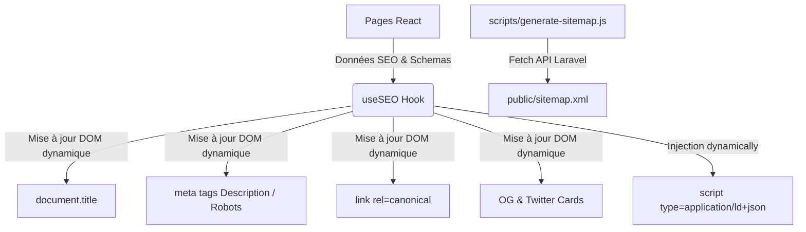

# HAFROSE — Phase 5.3 — Documentation SEO & Référencement

Cette documentation décrit l'ensemble des optimisations appliquées au frontend de l'application HAFROSE pour le référencement naturel (SEO), le partage sur les réseaux sociaux (Open Graph et Twitter Cards) et la gestion des données structurées (Schema.org).

---

## 1. Architecture Technique de l'Optimisation SEO

Pour maximiser les performances et la maintenabilité, nous avons implémenté une solution centralisée basée sur un hook React personnalisé et un script de sitemap dynamique, sans ajouter de dépendance npm lourde.



---

## 2. Le Hook `useSEO`

Le hook personnalisé `useSEO` (situé dans `src/hooks/useSEO.js`) remplace et étend le comportement de l'ancien `useDocumentTitle` pour gérer tous les aspects SEO de manière réactive.

### Paramètres acceptés :

| Paramètre | Type | Par défaut | Description |
|---|---|---|---|
| `title` | `string` | `undefined` | Titre spécifique à la page (complété par " \| Hafrose"). |
| `description` | `string` | `undefined` | Meta description de la page. |
| `robots` | `string` | `'index, follow'` | Directive d'indexation pour les moteurs de recherche. |
| `canonical` | `string` | Dynamique | URL canonique absolue de la page (déduite de l'URL actuelle). |
| `ogType` | `string` | `'website'` | Type de page pour Open Graph (e.g. `'product'`, `'website'`). |
| `ogImage` | `string` | Défaut | URL de l'image de partage. |
| `schema` | `Object` / `Array` | `undefined` | Objet(s) de données structurées JSON-LD injecté(s). |

### Exemple d'intégration dans une page :

```javascript
import useSEO from '../../hooks/useSEO';

export default function MyPage() {
  useSEO({
    title: 'Ma Super Page',
    description: 'Une superbe description optimisée pour le SEO.',
    canonical: 'https://hafrose.com/ma-super-page',
    schema: {
      '@context': 'https://schema.org',
      '@type': 'WebPage',
      name: 'Ma Super Page',
      url: 'https://hafrose.com/ma-super-page'
    }
  });
  
  return (
    // ...
  );
}
```

---

## 3. Données Structurées (JSON-LD) Implémentées

Les données structurées aident Google à comprendre le contenu de nos pages et à afficher des résultats enrichis (Rich Snippets) :

1. **Page d'Accueil (`Home`)** :
   - `Organization` : Informations sur la marque (nom, logo, coordonnées, réseaux sociaux).
   - `WebSite` : Barre de recherche intégrée aux résultats de recherche de Google (`SearchAction`).
2. **Page Boutique (`Shop`)** :
   - `CollectionPage` : Regroupement de la collection de produits.
3. **Fiche Produit (`Product`)** :
   - `Product` : Nom, description, images du produit.
   - `Offer` : Prix, devise, disponibilité (en stock / en rupture) et vendeur.
   - `AggregateRating` (si avis existants) : Note moyenne et nombre d'avis rédigés pour déclencher l'affichage des étoiles dans les résultats de recherche Google.
   - `Review` (si avis existants) : Détail des avis rédigés (auteur, note individuelle, corps de l'avis).
   - `BreadcrumbList` : Fil d'ariane permettant d'afficher le chemin de navigation dans les résultats Google.
4. **À Propos (`About`)** :
   - `AboutPage` & `Organization`.
5. **Contact (`Contact`)** :
   - `LocalBusiness` : Coordonnées physiques de la boutique, adresse, adresse e-mail, horaires d'ouverture.

---

## 4. Gestion de l'Indexation (Robots & Sitemap)

### `public/robots.txt`

Le fichier `robots.txt` a été enrichi avec des directives strictes :
- **Autorisation** : Toutes les pages de contenu public (`/`, `/shop`, `/about`, `/contact`, `/products/*`).
- **Interdiction (Disallow)** :
  - `/admin/` : Administration privée.
  - `/api/` : Points de terminaison API Laravel.
  - `/cart` & `/order-confirmation` : Pages d'achat à ne pas indexer.
- **Règles par User-agent** : Différenciation de crawl pour `Googlebot` et `Bingbot` (avec `Crawl-delay`).

### Sitemap Dynamique (`public/sitemap.xml`)

Le script `scripts/generate-sitemap.js` automatise la génération du sitemap :
1. Il extrait tous les produits actifs (`/api/products`) et les catégories (`/api/categories`) du backend Laravel.
2. Il combine ces éléments avec les pages et URL de filtres de catégories statiques.
3. Il génère un sitemap XML valide respectant le schéma standard.
4. **Sécurité & Résilience** : Si l'API backend Laravel est indisponible, le script génère automatiquement un sitemap de secours contenant les pages et filtres statiques pour éviter de vider le fichier existant.

Ce script s'exécute automatiquement après chaque build de production grâce au hook `postbuild` configuré dans `package.json` :
```bash
npm run build # Lance le build de Vite puis génère le sitemap automatiquement
```
Il peut aussi être lancé manuellement :
```bash
npm run sitemap
```

---

## 5. Audit d'Accessibilité & Structure HTML

- **Hiérarchie des titres (H1-H6)** : Vérifiée et validée pour chaque page. Chaque page de contenu comporte un unique `<h1>` décrivant clairement son sujet principal.
- **Accessibilité des images** : Toutes les balises `` de premier plan et des composants clés possèdent des attributs `alt` pertinents et descriptifs.
- **Pages transactionnelles sécurisées** : Les pages privées ou à faible valeur éditoriale (comme le panier ou la confirmation de commande) sont configurées dynamiquement avec `<meta name="robots" content="noindex, nofollow">` pour éviter qu'elles ne polluent les index de recherche.
